# Vault 시스템 동작 가이드

> 이 문서는 `CLAUDE.md`에 정의된 지식 관리 시스템이 어떻게 동작하는지 설명합니다. Obsidian에서 Mermaid 플러그인을 켜면 차트가 렌더링됩니다.

---

## 1. 한 문장 요약

**사용자가 자료를 넣고 질문하면, LLM이 자동으로 지식 그래프를 만들고 유지한다.**

일반적인 RAG(검색 증강 생성)는 질문할 때마다 원본을 처음부터 뒤진다. 이 시스템은 다르다. 자료가 들어오면 LLM이 한 번 **컴파일**해서 정리해두고, 이후엔 정리된 위키에서 바로 답을 찾는다. 자료가 쌓일수록 위키가 점점 풍부해진다.

---

## 2. 역할 분담

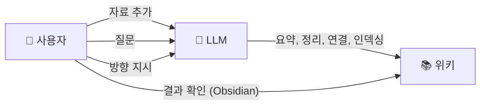

|  | 하는 일 |
| --- | --- |
| **사용자** | 자료를 넣고, 질문하고, 분석 방향을 잡는다 |
| **LLM** | 요약, 상호 참조, 분류, 인덱싱, 일관성 유지 — 모든 기록 관리를 담당한다 |
| **Obsidian** | 위키를 보고 탐색하는 뷰어 (IDE 역할) |

---

## 3. 전체 아키텍처: 3계층

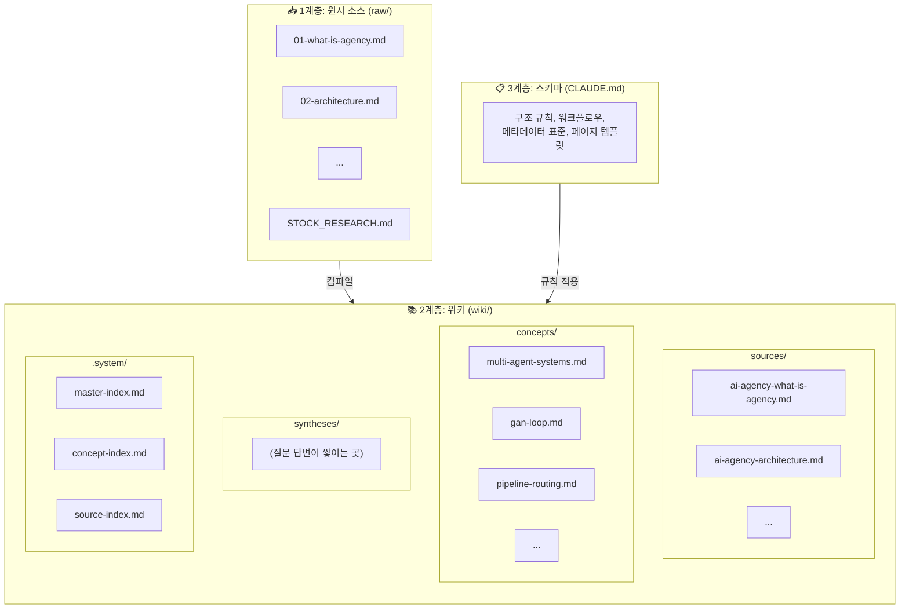

| 계층 | 위치 | 누가 관리하나 | 역할 |
| --- | --- | --- | --- |
| **원시 소스** | `raw/` | 사용자가 넣음 | 불변 원본. LLM은 읽기만 한다 |
| **위키** | `wiki/` | LLM이 생성/관리 | 정리된 지식 그래프. 사용자는 읽는다 |
| **스키마** | `CLAUDE.md` | 사용자+LLM이 함께 발전 | 위키의 구조와 규칙을 정의 |

---

## 4. 지식 객체 4가지

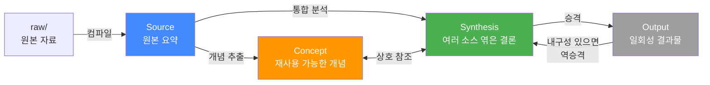

| 객체 | 위치 | 비유 | 예시 |
| --- | --- | --- | --- |
| **Source** | `wiki/sources/` | 원본 자료의 요약 카드 | "AI Agency 아키텍처 요약" |
| **Concept** | `wiki/concepts/` | 사전의 항목 | "GAN Loop", "멀티에이전트 시스템" |
| **Synthesis** | `wiki/syntheses/` | 연구 보고서의 결론 | "Agency vs Stock Research 통신 방식 비교" |
| **Output** | `output/` | 일회성 산출물 | 보고서, 슬라이드, Q&A 노트 |

**핵심:** Source는 1:1 요약이고, Concept는 여러 Source에서 반복되는 아이디어, Synthesis는 여러 개를 엮은 통합 결론이다.

---

## 5. 핵심 워크플로우

### 5-1. 컴파일 (자료 → 위키)

사용자가 `raw/`에 자료를 넣고 "컴파일 해줘"라고 하면:

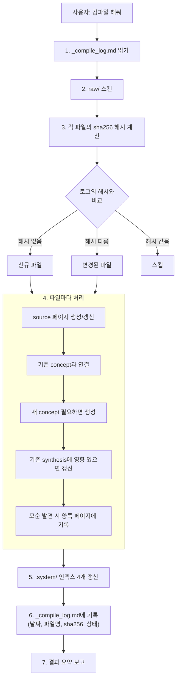

**중요한 원칙:**

- 하나의 소스가 10\~15개 기존 페이지에 영향을 줄 수 있다
- 새 페이지를 만드는 것보다 **기존 페이지를 풍부하게 하는 것**이 더 중요
- 새 데이터가 기존 주장과 모순되면 양쪽 페이지에 명시

### 5-2. 질문 답변 (위키 → 답변)

사용자가 질문하면:

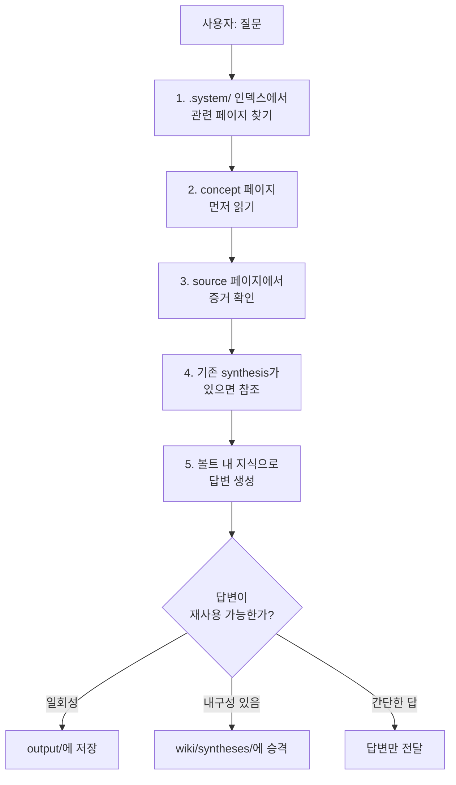

**핵심:** 좋은 답변은 사라지지 않고 위키에 축적된다. 질문을 할수록 위키가 풍부해진다.

### 5-3. 점검/린트 (위키 건강 관리)

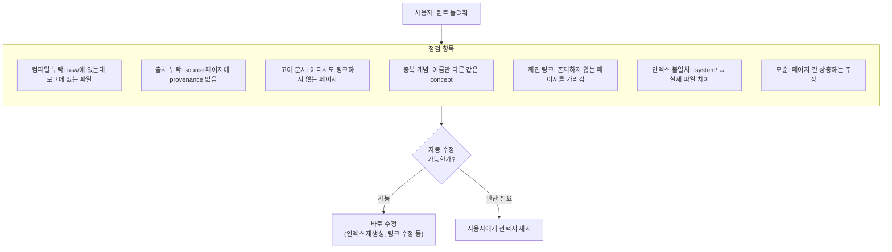

---

## 6. 세션 간 컨텍스트 복구

LLM은 세션이 끝나면 대화를 잊는다. 하지만 **위키가 있으면 다음 세션에서 이전 맥락을 즉시 복구**할 수 있다.

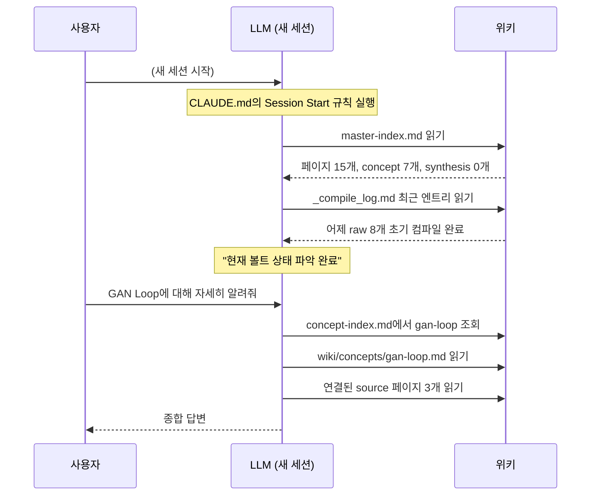

---

## 7. 파일 구조 한눈에

```
Vault/
├── raw/                          ← 사용자가 넣는 원본 자료
│   ├── 01-what-is-agency.md
│   ├── 02-architecture.md
│   ├── ...
│   └── STOCK_RESEARCH_ARCHITECTURE.md
│
├── wiki/                         ← LLM이 만들고 관리하는 지식 그래프
│   ├── sources/                  ← 원본 1:1 요약 (파란색)
│   │   ├── ai-agency-what-is-agency.md
│   │   └── ...
│   ├── concepts/                 ← 재사용 개념 (주황색)
│   │   ├── multi-agent-systems.md
│   │   ├── gan-loop.md
│   │   └── ...
│   ├── syntheses/                ← 통합 분석 (초록색)
│   │   └── (질문을 하면 여기에 쌓임)
│   └── .system/                  ← 인덱스 (숨김)
│       ├── master-index.md
│       ├── source-index.md
│       ├── concept-index.md
│       └── synthesis-index.md
│
├── output/                       ← 일회성 결과물
├── docs/                         ← 프로젝트 문서
├── _compile_log.md               ← 컴파일 이력 (날짜, 해시, 상태)
├── CLAUDE.md                     ← 시스템 규칙 (스키마)
└── .obsidian/                    ← Obsidian 설정
    ├── graph.json                ← 그래프 뷰 (색상/화살표 설정됨)
    └── ...
```

---

## 8. Obsidian 그래프 뷰

### 8-1. 색상 구분

그래프 뷰에서 지식 객체를 색상으로 구분한다:

| 색상 | 타입 | 의미 |
| --- | --- | --- |
| 🔵 파랑 | Source | 원본 자료 요약 (`wiki/sources/`) |
| 🟠 주황/빨강 | Concept | 재사용 가능한 개념 (`wiki/concepts/`) |
| 🟢 초록 | Synthesis | 통합 분석/결론 (`wiki/syntheses/`) |
| ⚫ 회색 | 기타 | raw 파일 등 위키 외 문서 (이상적으로는 안 보여야 함) |

### 8-2. Obsidian에서 직접 설정하는 방법

`graph.json`을 파일로 직접 수정하면 Obsidian이 UI 상태로 덮어쓸 수 있다. **반드시 Obsidian 그래프 뷰 UI에서 설정**해야 한다.

**색상 그룹 설정:**

1. 그래프 뷰를 연다 (좌측 리본에서 그래프 아이콘 클릭)
2. 그래프 뷰 좌측 상단의 **설정 아이콘** (슬라이더 모양) 클릭
3. **Groups** 섹션을 펼친다
4. `New group` 버튼을 3번 클릭해서 그룹 추가:

| Query 입력값 | 색상 선택 |
| --- | --- |
| `path:wiki/sources` | 파란색 |
| `path:wiki/concepts` | 주황색 또는 빨간색 |
| `path:wiki/syntheses` | 초록색 |

**기타 권장 설정:**

| 섹션 | 항목 | 값 | 이유 |
| --- | --- | --- | --- |
| Display | **Arrows** | 켜기 | source → concept → synthesis 방향성 표시 |
| Filters | **Orphans** | 끄기 | 연결 없는 노드 숨김으로 노이즈 감소 |

### 8-3. raw 파일이 그래프에 나타나는 문제

wiki 페이지에서 원본 파일 경로(`raw/파일명.md`)를 참조하면, Obsidian이 이것을 파일 링크로 인식하여 그래프에 회색 노드로 표시한다. raw 폴더에는 자료를 자유롭게 넣기 때문에 파일 단위로 제어하는 건 불가능하다.

**해결 방법:** 그래프 뷰 필터에서 raw 폴더 전체를 제외한다.

1. 그래프 뷰 설정 아이콘 클릭
2. **Filters** 섹션의 **Search** 입력란에 `-path:raw` 입력

이러면 raw/ 안의 모든 파일이 그래프에서 사라진다. raw에 어떤 파일을 넣든, wiki 페이지에서 어떻게 참조하든 상관없다.

---

## 9. 변경 감지: 어떻게 "바뀐 파일"을 아는가

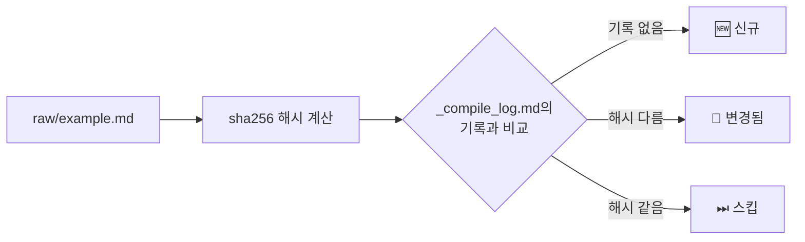

LLM의 주관적 판단이 아니라 **sha256 해시**라는 확실한 기준을 사용한다. 파일 내용이 1바이트라도 바뀌면 해시가 달라지므로, 변경 여부를 100% 정확하게 판단할 수 있다.

---

## 10. 개념(Concept)의 생명주기

위키가 커지면 개념도 진화한다:

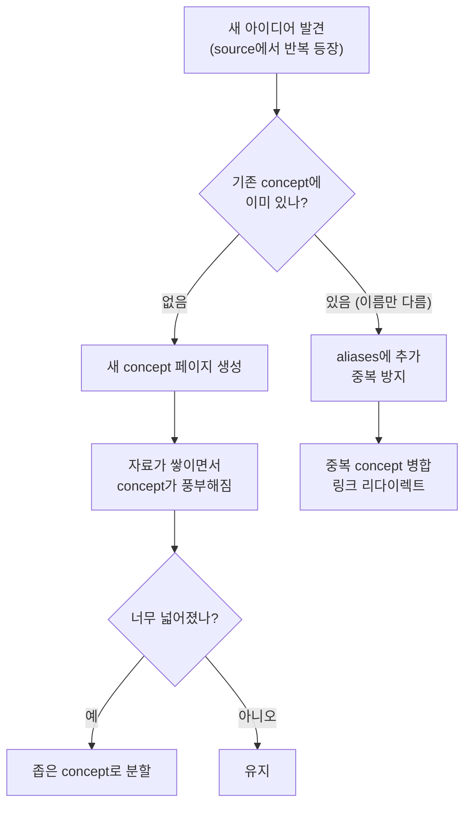

---

## 11. 자동화 스킬 3개

반복 작업을 명령어 하나로 실행할 수 있다:

| 스킬 | 명령어 | 하는 일 |
| --- | --- | --- |
| **compile** | `/compile` | raw/ → wiki/ 전체 파이프라인 |
| **graph-lint** | `/graph-lint` | 위키 품질 점검 + 자동 수정 |
| **bootstrap** | `/bootstrap` | 초기 셋업 1회성 실행 |

---

## 12. 전체 흐름 요약

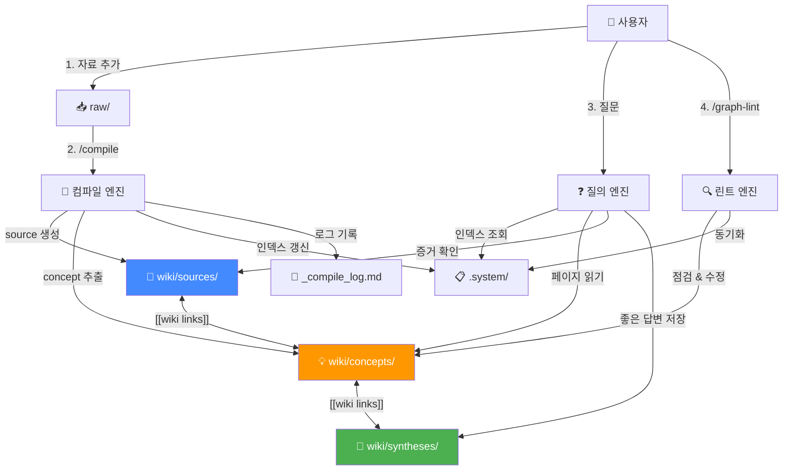

**요약:**

1. 자료를 넣는다 (`raw/`)
2. 컴파일한다 (`/compile`) → source, concept, 인덱스가 만들어진다
3. 질문한다 → 위키에서 답을 찾고, 좋은 답변은 synthesis로 저장된다
4. 주기적으로 린트한다 (`/graph-lint`) → 깨진 링크, 중복, 고아 문서를 정리한다
5. **자료가 쌓일수록 위키가 풍부해지고, 답변 품질이 올라간다**

---

## 13. 대용량 컴파일 처리

논문 등 큰 파일이 여러 개 동시에 들어오면 LLM의 컨텍스트 한계에 도달할 수 있다. 이를 방지하기 위한 규칙:

| 신규/변경 파일 수 | 처리 방식 |
| --- | --- |
| 3개 이하 | 한 세션에서 모두 처리 |
| 4개 이상 | 파일 하나씩 순차 처리, 파일마다 로그 기록 |

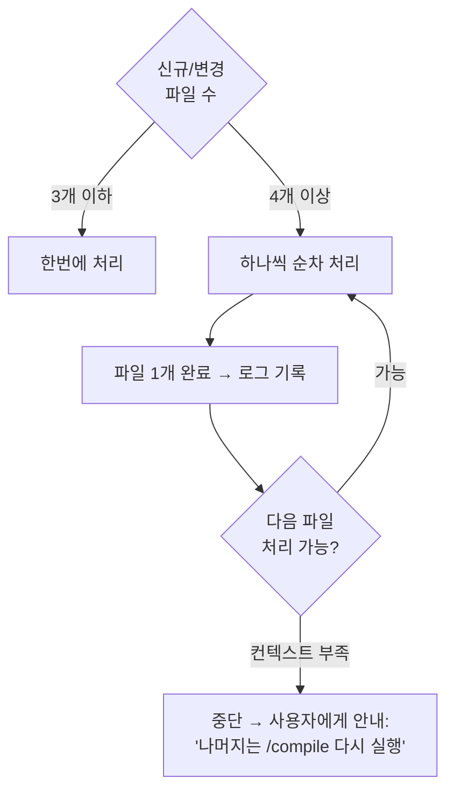

**왜 이렇게 하나:** 파일마다 로그를 기록하면 중간에 세션이 끊겨도 다음 `/compile`에서 이어서 처리할 수 있다. sha256 기반 변경 감지가 이미 있으므로, 처리 완료된 파일은 자동으로 스킵된다.

---

## 14. 파일명 및 입력 규칙

### 14-1. source 페이지 파일명 정규화

raw 파일은 한글, 공백, 특수문자 등 어떤 이름이든 상관없다. 하지만 wiki에 생성되는 source 페이지 파일명은 kebab-case 영어로 정규화된다.

| raw 파일명 | → source 페이지 파일명 |
| --- | --- |
| `삼성전자 분석.md` | `samsung-analysis.md` |
| `2026 Q1 실적 (확정).md` | `2026-q1-earnings.md` |
| `STOCK_RESEARCH.md` | `stock-research.md` |

**왜 이렇게 하나:** Obsidian에서 한글 파일명은 URL 인코딩 문제, git 호환성 문제가 생길 수 있다. 또한 sha256 해시 계산 시 공백/특수문자가 포함된 경로에서 오류가 발생할 수 있다.

### 14-2. topic은 여러 개 가능

하나의 자료가 여러 주제에 걸칠 수 있다. frontmatter에서 `topic`을 리스트로 지정할 수 있다:

```yaml
topic:
  - ai-agency
  - stock-research
```

### 14-3. 비텍스트 파일은 변환 후 저장

raw/에는 텍스트/마크다운 파일만 넣는다. PDF, 이미지 등 비텍스트 파일은 **이 시스템 밖에서** 텍스트로 변환한 뒤 raw/에 저장해야 한다. 변환은 LLM이 하는 것이 아니라 사용자가 외부 도구로 처리한다.

#### 소스 유형별 변환 방법

**PDF 논문/보고서:**

| 도구 | 설치 | 사용법 | 특징 |
|------|------|--------|------|
| [marker](https://github.com/VikParuchuri/marker) | `pip install marker-pdf` | `marker_single 파일.pdf --output_dir raw/` | 표/수식/이미지 포함 마크다운 변환. 논문에 가장 적합 |
| [pdftotext](https://poppler.freedesktop.org/) | `brew install poppler` | `pdftotext -layout 파일.pdf raw/파일.md` | 단순 텍스트 추출. 빠르지만 표/수식 깨짐 |
| macOS 기본 | 설치 불필요 | `textutil -convert txt 파일.pdf -output raw/파일.md` | 간단한 문서용. 레이아웃 무시 |

**YouTube 영상:**

| 도구 | 설치 | 사용법 |
|------|------|--------|
| [yt-dlp](https://github.com/yt-dlp/yt-dlp) | `brew install yt-dlp` | `yt-dlp --write-auto-sub --sub-lang ko --skip-download -o "raw/%(title)s" URL` |
| YouTube 자막 복사 | 설치 불필요 | 영상 → 더보기 → 스크립트 보기 → 복사해서 .md로 저장 |

**팟캐스트/음성:**

| 도구 | 설치 | 사용법 |
|------|------|--------|
| [whisper](https://github.com/openai/whisper) | `pip install openai-whisper` | `whisper 음성파일.mp3 --language ko --output_format txt --output_dir raw/` |
| [MacWhisper](https://goodsnooze.gumroad.com/l/macwhisper) | 앱 설치 | GUI에서 파일 드래그 → 텍스트 내보내기 |

**웹 기사:**

| 도구 | 설치 | 사용법 |
|------|------|--------|
| [Obsidian Web Clipper](https://obsidian.md/clipper) | 브라우저 확장 설치 | 기사 페이지에서 클릭 → raw/ 폴더에 저장 설정 |
| [Jina Reader](https://r.jina.ai) | 설치 불필요 | `https://r.jina.ai/기사URL` 접속 → 마크다운 복사 → .md로 저장 |

**트위터/X 스레드:**

| 도구 | 설치 | 사용법 |
|------|------|--------|
| [Thread Reader](https://threadreaderapp.com/) | 설치 불필요 | 트윗에 `@threadreaderapp unroll` 답글 → 결과 페이지를 Web Clipper로 저장 |

#### 변환 후 권장 사항

- 변환된 파일 상단에 원본 출처(URL, 논문 ID, 영상 링크 등)를 기록해두면, `/compile` 시 source 페이지의 provenance가 정확해진다
- 파일명은 자유롭게 지어도 된다 — compile 스킬이 source 페이지 파일명을 kebab-case로 정규화한다

---

## 15. raw 파일 삭제/변경 시 대응

사용자가 raw/에서 파일을 삭제하거나 이름을 바꾸면, wiki에 "원본 없는 source 페이지"가 남을 수 있다.

`/graph-lint`가 이를 감지한다:

- source 페이지의 `source_file` 필드가 가리키는 raw 파일이 실제로 존재하지 않으면 보고
- 사용자에게 해당 source 페이지를 삭제할지, 유지할지 선택지 제시

---

## 16. 다른 RAG 방식과의 비교

### 16-1. 비교 요약

| 관점 | Naive RAG | Graph RAG | Vault (현재) |
| --- | --- | --- | --- |
| 핵심 방식 | 질문마다 벡터 검색 → 청크 조합 | 엔티티/관계 그래프 탐색 | 미리 컴파일된 위키에서 읽기 |
| 지식 축적 | 없음 (매번 처음부터) | 그래프 자체가 축적 | 질문 답변도 synthesis로 축적 |
| 모순 감지 | 불가능 | 가능 (자동화 수준에 따라) | 컴파일 시 양쪽 페이지에 기록 |
| 사람이 읽을 수 있나 | 아니오 (벡터DB) | 아니오 (트리플) | 예 (Obsidian) |
| 인프라 | 벡터DB 서버 | 그래프DB 서버 | 없음 (파일만) |
| \~50 소스 | 보통 | 좋음 | 가장 좋음 |
| \~500+ 소스 | 좋음 | 좋음 | 한계 시작 |

### 16-2. 현재 시스템의 핵심 강점

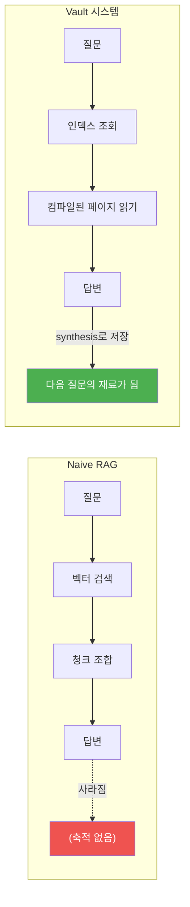

**복리 축적:** 다른 RAG는 답변이 사라지지만, 이 시스템은 좋은 답변이 synthesis로 저장되어 다음 질문의 재료가 된다. 질문을 많이 할수록 시스템이 똑똑해진다.

**사람이 직접 탐색 가능:** 벡터DB나 그래프DB는 사람이 직접 탐색할 수 없다. 이 시스템은 Obsidian에서 그래프 뷰로 지식 구조를 시각적으로 볼 수 있다.

**인프라 제로:** 서버, DB, 임베딩 파이프라인이 없다. 마크다운 파일 + LLM이 전부다.

### 16-3. 스케일 한계와 대응

현재 검색은 인덱스 파일(master-index.md) 기반이므로 수백 페이지까지는 잘 작동하지만, 수천 페이지에서 한계가 온다.

| 규모 | 상태 | 대응 |
| --- | --- | --- |
| \~100 소스 | 잘 작동 | 현재 구조 유지 |
| \~500 소스 | 한계 시작 | qmd 같은 로컬 검색 엔진 도입 검토 |
| \~1000+ | 인덱스 방식 불가 | 하이브리드 검색(BM25+벡터)으로 교체 |

**핵심:** 스케일 문제는 "해결 불가능한 한계"가 아니라 "검색 레이어만 교체하면 되는 문제"다. 시스템 구조 자체를 바꿀 필요는 없다.

---

## 17. 설계 변경 이력

이 시스템은 한 번에 완성된 것이 아니라, 문제를 발견하고 고치면서 점진적으로 발전했다. 아래는 주요 변경과 그 이유를 기록한 것이다.

### 17-1. 초기 설계 (CLAUDE.md 최초 버전)

카파시의 [LLM Wiki 패턴](https://gist.github.com/karpathy/1dd0294ef9567971c1e4348a90d69285)에서 영감을 받아 출발. 3계층(raw → wiki → schema), source/concept/synthesis 분류, 인덱스 기반 탐색이라는 뼈대를 잡았다.

### 17-2. 변경 감지 도입 — "materially changed"의 정의

**문제:** 초기 CLAUDE.md에 "materially changed files should be recompiled"이라고만 적혀있고, 무엇이 "변경됨"인지 기준이 없었다. LLM이 매 세션마다 컨텍스트를 잃으므로, 이전 컴파일과 현재 파일의 차이를 판단할 수단이 없었다.

**해결:** sha256 체크섬 기반 변경 감지 도입. `_compile_log.md`에 해시를 기록하고, 컴파일 시 해시가 다르면 변경으로 판단. 결정적(deterministic)이므로 LLM의 주관적 판단에 의존하지 않는다.

### 17-3. Session Start 규칙 추가

**문제:** LLM은 세션이 끝나면 대화를 잊는다. 새 세션마다 볼트 상태를 처음부터 파악해야 했다.

**해결:** 카파시 원문의 통찰 — "세션 시작 시 index.md를 먼저 읽으면 축적된 지식의 지도를 한 번에 파악" — 을 반영. `master-index.md`와 `_compile_log.md` 최근 엔트리를 세션 시작 시 읽도록 규칙 추가.

### 17-4. 기존 페이지 갱신 원칙 + 모순 감지

**문제:** 컴파일이 "새 source 페이지만 만들고 끝"이 되어, 기존 concept/synthesis 페이지가 업데이트되지 않았다. 새 자료가 기존 주장과 모순되어도 감지하지 않았다.

**해결:** "하나의 소스가 10\~15개 기존 페이지에 영향을 줄 수 있다. 기존 페이지를 풍부하게 하는 것이 더 중요하다" + "모순 발견 시 양쪽 페이지에 명시"하는 규칙 추가.

### 17-5. graph.json 직접 수정 → Obsidian UI 설정으로 전환

**문제:** bootstrap 스킬이 graph.json을 파일로 수정했지만, Obsidian이 자체 UI 상태로 덮어써서 설정이 매번 초기화되었다.

**해결:** graph.json 직접 수정을 포기하고, Obsidian 그래프 뷰 UI에서 직접 설정하도록 가이드 변경. bootstrap 스킬에서 graph.json 설정 단계를 제거.

### 17-6. raw 파일 그래프 노출 → 필터로 해결

**문제:** source 페이지에서 `raw/파일명.md`를 참조하면 Obsidian이 이를 링크로 인식하여 그래프에 회색 노드로 표시되었다. raw 폴더에는 자료를 자유롭게 넣기 때문에 파일 단위 제어는 불가능.

**시행착오:** 처음에는 source 페이지의 경로 표기를 바꿔서 해결하려 했으나 (`raw/파일명.md` → `파일명.md (raw/)`), 여전히 해결되지 않았고, raw 파일 이름에 규칙을 강제할 수도 없었다.

**최종 해결:** 그래프 뷰 필터에 `-path:raw` 입력. 가장 단순하고 확실한 방법.

### 17-7. 대용량 파일 컨텍스트 오버플로우 방지

**문제:** 논문 급의 대용량 파일이 여러 개 동시에 들어오면 한 세션에서 모두 처리할 수 없다.

**해결:** 파일 수에 따라 처리 방식 분기 (3개 이하: 한번에, 4개 이상: 하나씩). 파일마다 로그를 기록하여 세션이 끊겨도 이어서 처리 가능. sha256 변경 감지가 이미 있으므로 완료된 파일은 자동 스킵.

### 17-8. 파일명 정규화 + topic 리스트 + 비텍스트 파일 규칙

**문제:** (1) 한글/공백/특수문자 파일명으로 해시 계산 실패 가능. (2) 하나의 자료가 여러 topic에 걸치는데 단일 값만 허용. (3) PDF 바이너리를 raw/에 넣으면 LLM이 읽을 수 없음.

**해결:** (1) source 페이지 파일명을 kebab-case 영어로 정규화. (2) topic 필드에 리스트 허용. (3) 비텍스트 파일은 텍스트 변환 후 저장 규칙 추가.

### 17-9. raw 파일 삭제 감지

**문제:** 사용자가 raw 파일을 삭제/이름변경하면 wiki에 원본 없는 source 페이지가 남는다.

**해결:** graph-lint에 "source_file이 가리키는 raw 파일이 존재하지 않는 경우" 점검 항목 추가.