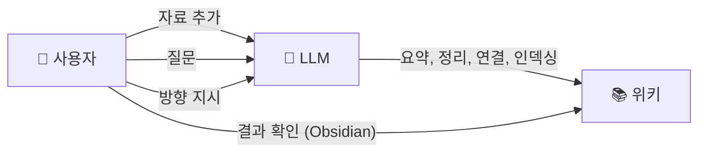
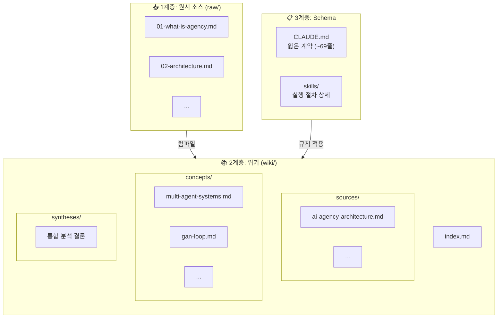
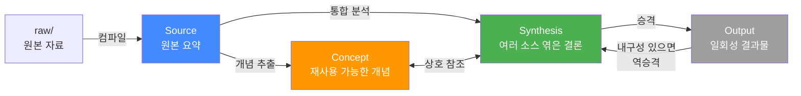
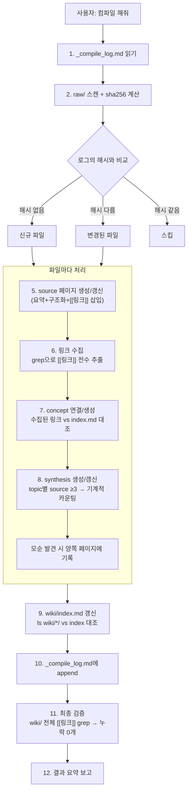
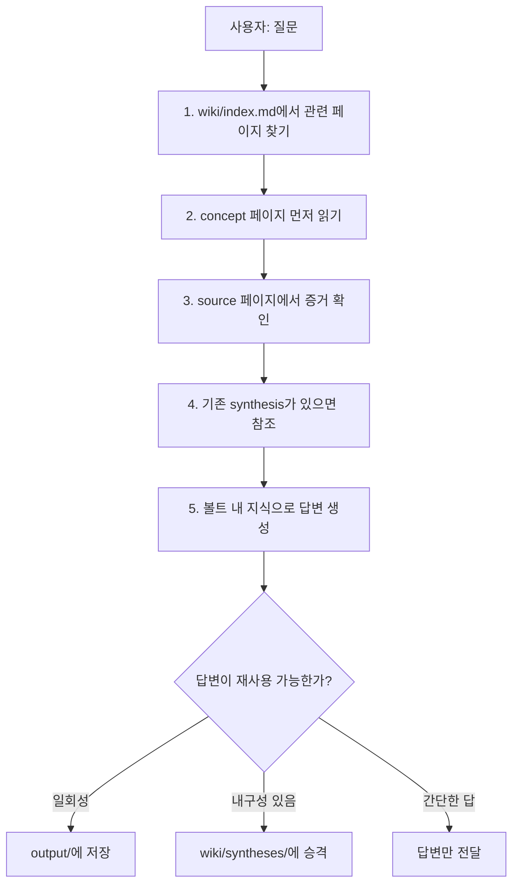
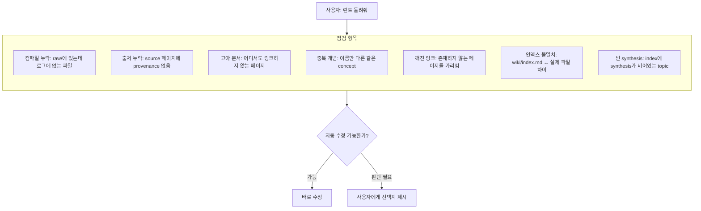
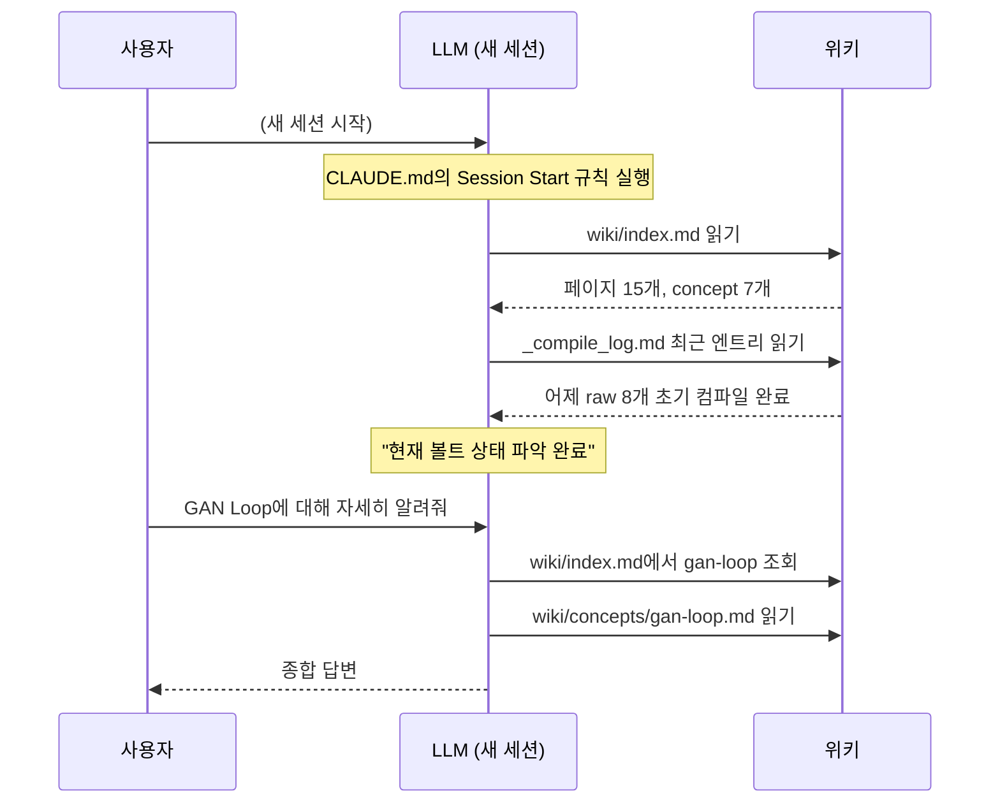
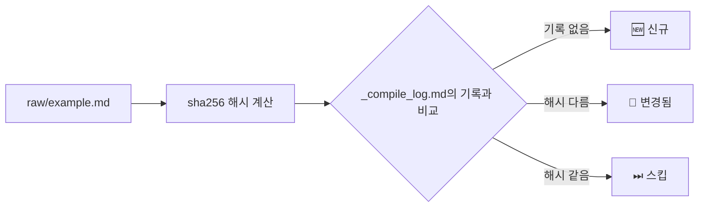
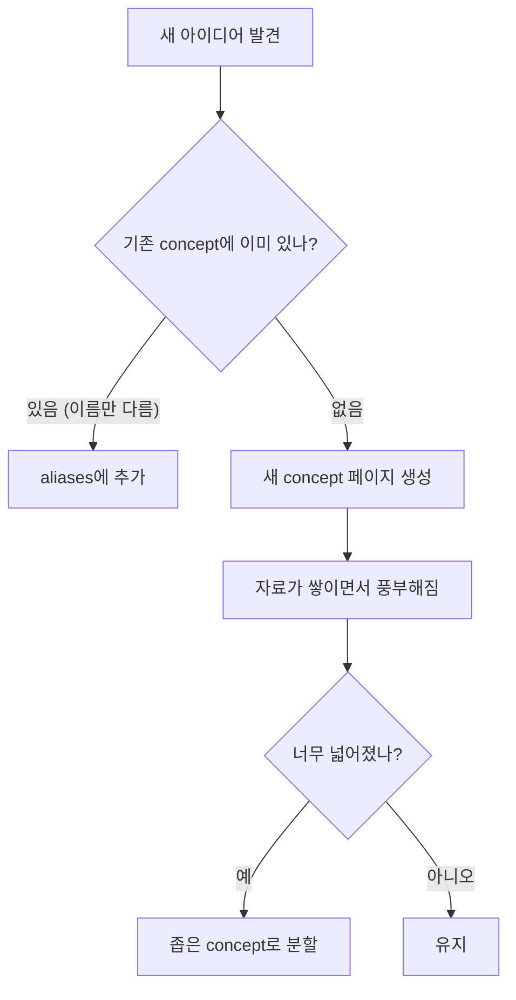
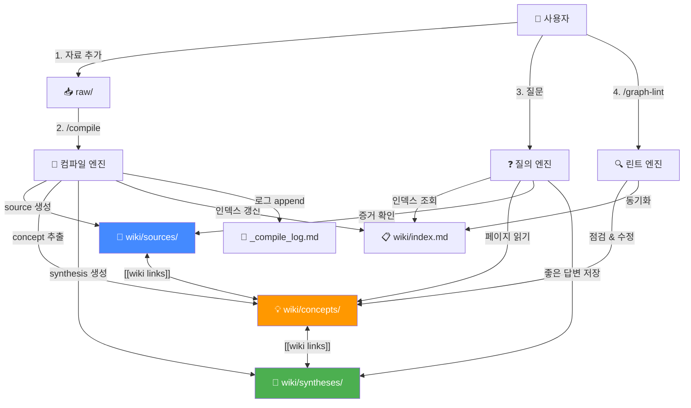

# Vault 시스템 동작 가이드

> Obsidian에서 Mermaid 플러그인을 켜면 차트가 렌더링된다.

---

## 1. 설계 철학: Karpathy의 LLM Wiki

이 시스템은 Karpathy의 [LLM Wiki 패턴](https://gist.github.com/karpathy/442a6bf555914893e9891c11519de94f)을 구현한 것이다.

**핵심 아이디어:** 일반 RAG는 질문할 때마다 원본을 처음부터 뒤진다. LLM Wiki는 다르다. 자료가 들어오면 LLM이 한 번 **컴파일**해서 위키로 정리하고, 이후엔 위키에서 바로 답을 찾는다. 위키는 자료가 쌓일수록 복리로 풍부해진다.

**Karpathy 원칙 → 우리 설계:**

| Karpathy 원칙 | 우리 구현 | 이유 |
| --- | --- | --- |
| 3 layers (raw / wiki / schema) | `raw/` → `wiki/` → `CLAUDE.md` | 원본은 불변, 위키는 LLM이 소유, schema는 계약 |
| `index.md` 1개 | `wiki/index.md` | 4개 인덱스는 동기화 비용 &gt; 가치. 1개면 충분 |
| `log.md` 1개, append-only | `_compile_log.md` | 절대 교체하지 않는다. grep으로 파싱 가능 |
| 3 operations (ingest / query / lint) | `/compile`, Query, `/graph-lint` | 그 이상은 과잉. 이 3개가 전부 |
| Schema는 얇은 계약 | `CLAUDE.md` \~69줄 | 매 세션 자동 로드 → 짧을수록 좋다 |
| "Everything is optional and modular" | schema(무엇을) ↔ skill(어떻게) 분리 | SKILL은 해당 명령어 실행 시에만 로드 |
| Obsidian은 IDE | 그래프 뷰 + `[[wiki links]]` | LLM이 프로그래머, 위키가 코드베이스 |

**한 문장 요약:** 사용자가 자료를 넣고 질문하면, LLM이 자동으로 지식 그래프를 만들고 유지한다.

---

## 2. 역할 분담



|  | 하는 일 |
| --- | --- |
| **사용자** | 자료를 넣고, 질문하고, 분석 방향을 잡는다 |
| **LLM** | 요약, 상호 참조, 분류, 인덱싱, 일관성 유지 — 모든 기록 관리를 담당한다 |
| **Obsidian** | 위키를 보고 탐색하는 뷰어 (IDE 역할) |

---

## 3. 아키텍처: 3계층 + 얇은 Schema



| 계층 | 위치 | 역할 |
| --- | --- | --- |
| **원시 소스** | `raw/` | 불변 원본. LLM은 읽기만 한다 |
| ↳ 이미지/첨부 | `raw/assets/` | 다이어그램, 스크린샷, 이미지. Obsidian 첨부파일 경로를 여기로 지정 |
| **위키** | `wiki/` | 정리된 지식 그래프 |
| **Schema** | `CLAUDE.md` + `skills/` | 구조 규칙(schema)과 실행 절차(runbook)를 분리 |

### Schema ↔ Runbook 분리 원칙

Karpathy 철학의 핵심: schema는 **얇은 계약**이어야 한다.

| 파일 | 역할 | 내용 |
| --- | --- | --- |
| `CLAUDE.md` (\~69줄) | **Schema** — "무엇을" | 계층 정의, 메타데이터 규약, 3대 연산 선언, 무결성 규칙 |
| `skills/compile/SKILL.md` | **Runbook** — "어떻게" | 컴파일 10단계 절차, 파일명 정규화, 대용량 처리 |
| `skills/graph-lint/SKILL.md` | **Runbook** | 린트 점검 항목, 자동 수정 규칙 |

**이렇게 분리하는 이유:**

- CLAUDE.md는 매 세션마다 자동 로드된다 → 짧을수록 컨텍스트 절약
- 워크플로우 상세가 CLAUDE.md와 SKILL 양쪽에 중복되면, 한쪽만 수정했을 때 stale 상태 발생
- SKILL은 해당 명령어(`/compile`, `/graph-lint`) 실행 시에만 로드된다

---

## 4. 지식 객체 4가지



| 객체 | 위치 | 비유 | 예시 |
| --- | --- | --- | --- |
| **Source** | `wiki/sources/` | 원본 자료의 요약 카드 | "AI Agency 아키텍처 요약" |
| **Concept** | `wiki/concepts/` | 사전의 항목 | "GAN Loop", "멀티에이전트 시스템" |
| **Synthesis** | `wiki/syntheses/` | 연구 보고서의 결론 | "Agency vs Stock Research 통신 비교" |
| **Output** | `output/` | 일회성 산출물 | 보고서, 슬라이드, Q&A 노트 |

**핵심:** Source는 1:1 요약, Concept는 여러 Source에서 반복되는 아이디어, Synthesis는 여러 개를 엮은 통합 결론.

---

## 5. 3대 연산

### 5-1. 컴파일 (`/compile`) — 자료 → 위키



**컴파일의 핵심 원칙:**

- 하나의 소스가 10\~15개 기존 페이지에 영향을 줄 수 있다
- 새 페이지를 만드는 것보다 **기존 페이지를 풍부하게 하는 것**이 더 중요
- 새 데이터가 기존 주장과 모순되면 양쪽 페이지에 명시
- `[[링크]]` **타깃이 실제 존재하는지 반드시 검증** — 없으면 concept를 생성하거나 링크를 제거
- **synthesis는 "검토"만이 아니라 "생성"도 포함** — 동일 주제 source가 3개 이상이면 synthesis 생성을 검토
- source 페이지는 원문 복사가 아니라 **핵심 클레임을 추출·요약·구조화한 컴파일 결과물**이다. 원문이 필요하면 `raw/`에서 읽는다.

### index.md의 역할: 컴파일의 지도

`wiki/index.md`는 단순한 목차가 아니라 **컴파일 전 과정에서 LLM이 참조하는 지도**다. Karpathy 원문에서:

> "When answering a query, the LLM reads the index first to find relevant pages, then drills into them."

컴파일도 마찬가지다. LLM은 index.md를 먼저 읽고, 거기서 기존 위키의 전체 구조를 파악한 뒤에 새 자료를 통합한다.

**컴파일 단계별 index.md 활용:**

| 단계 | index.md 활용 방식 |
| --- | --- |
| **링크 수집** (Step 6) | Step 5에서 생성한 source 페이지들을 `grep`으로 다시 읽어서 `[[wiki links]]`를 **기계적으로 전수 수집**한다. 수집된 목록과 index.md의 기존 페이지를 대조하여 "존재하지 않는 링크 타깃" 목록을 만든다. LLM의 기억이 아닌 파일 시스템에서 추출하므로 모델 성능과 무관하게 누락이 없다. |
| **concept 연결/생성** (Step 7) | Step 6의 "존재하지 않는 링크 타깃" 목록을 하나씩 처리한다. index.md의 Concepts 섹션과 기존 concept의 **aliases**까지 대조하여, 이름만 다른 같은 개념이면 링크를 수정하고, 진짜 없으면 새로 만든다. 처리 후 누락 0개를 재확인한다. |
| **synthesis 생성/갱신** (Step 8) | 모든 source 페이지의 frontmatter `topic`을 수집하여 topic별 source 수를 **기계적으로 카운팅**한다. 3개 이상인 topic에 대해 `wiki/syntheses/`에 파일이 있는지 `ls`로 확인하고, 없으면 생성, 있으면 갱신한다. |
| **인덱스 갱신** (Step 9) | `ls wiki/sources/ wiki/concepts/ wiki/syntheses/`로 실제 파일 목록을 수집하고, index.md와 대조하여 누락은 추가, 불일치는 제거한다. |
| **최종 검증** (Step 11) | `wiki/` 전체에서 `[[wiki links]]`를 grep으로 추출하고, 타깃 파일 존재 여부를 일괄 확인한다. **누락 0개여야 컴파일 완료로 판정.** |

**왜 기계적 단계가 중요한가?**

Step 6(링크 수집), Step 8(synthesis 카운팅), Step 9(인덱스 대조), Step 11(최종 검증)은 모두 `grep`/`ls` 같은 **기계적 추출 → 목록 대조 → 하나씩 처리** 패턴을 따른다. LLM의 기억이나 판단에 의존하면 약한 모델에서 concept 미생성, synthesis 스킵, 인덱스 불일치가 발생한다. 파일 시스템에서 기계적으로 추출하면 모델 성능과 무관하게 누락이 없다.

**요약:** index.md가 없거나 비어있으면 LLM은 기존 위키 구조를 모른 채 컴파일하게 되고, 중복 concept 생성, 깨진 링크, 누락된 synthesis가 발생한다. **index.md는 컴파일 품질의 전제 조건**이다.

### 5-2. 질문 답변 — 위키 → 답변



**핵심:** 좋은 답변은 사라지지 않고 위키에 축적된다.

### 5-3. 린트 (`/graph-lint`) — 위키 건강 관리



---

## 6. 세션 간 컨텍스트 복구

LLM은 세션이 끝나면 대화를 잊는다. 하지만 **위키가 있으면 다음 세션에서 이전 맥락을 즉시 복구**할 수 있다.



---

## 7. 파일 구조 한눈에

```
Vault/
├── raw/                          ← 사용자가 넣는 원본 자료
│   ├── assets/                   ← 이미지, 다이어그램, 스크린샷
│   ├── 01-what-is-agency.md
│   └── ...
│
├── wiki/                         ← LLM이 관리하는 지식 그래프
│   ├── index.md                  ← 통합 인덱스 (source/concept/synthesis 전체)
│   ├── sources/                  ← 원본 1:1 요약 (파란색)
│   ├── concepts/                 ← 재사용 개념 (주황색)
│   └── syntheses/                ← 통합 분석 (초록색)
│
├── output/                       ← 일회성 결과물
├── docs/                         ← 프로젝트 문서
├── .claude/skills/               ← 실행 절차 (runbook)
│   ├── compile/SKILL.md
│   └── graph-lint/SKILL.md
├── _compile_log.md               ← 컴파일 이력 (append-only)
├── CLAUDE.md                     ← 시스템 규칙 (얇은 schema, ~69줄)
└── .obsidian/                    ← Obsidian 설정
```

---

## 8. Obsidian 그래프 뷰

### 8-1. 색상 구분

| 색상 | 타입 | 의미 |
| --- | --- | --- |
| 🔵 파랑 | Source | 원본 자료 요약 (`wiki/sources/`) |
| 🟠 주황/빨강 | Concept | 재사용 가능한 개념 (`wiki/concepts/`) |
| 🟢 초록 | Synthesis | 통합 분석/결론 (`wiki/syntheses/`) |

### 8-2. 설정 방법

`graph.json`을 파일로 직접 수정하면 Obsidian이 UI 상태로 덮어쓸 수 있다. **반드시 Obsidian 그래프 뷰 UI에서 설정**해야 한다.

**색상 그룹:**

1. 그래프 뷰 → 설정 아이콘 → Groups
2. 그룹 3개 추가:

| Query | 색상 |
| --- | --- |
| `path:wiki/sources` | 파란색 |
| `path:wiki/concepts` | 주황색 |
| `path:wiki/syntheses` | 초록색 |

**기타 권장 설정:**

| 항목 | 값 | 이유 |
| --- | --- | --- |
| Arrows | 켜기 | 방향성 표시 |
| Orphans | 끄기 | 노이즈 감소 |
| Search 필터 | `-path:raw` | raw 파일이 그래프에 나타나는 것 방지 |

### 8-3. 이미지/첨부파일 설정

Obsidian Settings → Files and links → **Attachment folder path**를 `raw/assets/`로 지정한다.

- Obsidian에서 이미지를 붙여넣거나 드래그하면 `raw/assets/`에 자동 저장
- wiki 페이지에서 `![[image.png]]`로 참조하면 `raw/assets/image.png`를 표시
- LLM은 텍스트를 먼저 읽고, 참조된 이미지는 따로 확인 (인라인 이미지 일괄 처리 불가)

**팁:** Settings → Hotkeys에서 "Download attachments for current file"에 단축키를 지정하면 (예: `Ctrl+Shift+D`), 외부 URL 이미지를 로컬로 다운로드할 수 있다.

---

## 9. 변경 감지



sha256 해시 기반이므로 LLM의 주관적 판단에 의존하지 않는다. 1바이트라도 바뀌면 감지된다.

---

## 10. 개념(Concept)의 생명주기



---

## 11. 자동화 스킬

| 스킬 | 명령어 | 하는 일 |
| --- | --- | --- |
| **compile** | `/compile` | raw/ → wiki/ 전체 파이프라인 |
| **graph-lint** | `/graph-lint` | 위키 품질 점검 + 자동 수정 |

---

## 12. 전체 흐름 요약



**요약:**

1. 자료를 넣는다 (`raw/`)
2. 컴파일한다 (`/compile`) → source, concept, synthesis, 인덱스가 만들어진다
3. 질문한다 → 위키에서 답을 찾고, 좋은 답변은 synthesis로 저장된다
4. 주기적으로 린트한다 (`/graph-lint`) → 깨진 링크, 중복, 고아 문서를 정리한다
5. **자료가 쌓일수록 위키가 풍부해지고, 답변 품질이 올라간다**

---

## 13. 대용량 컴파일 처리

| 신규/변경 파일 수 | 처리 방식 |
| --- | --- |
| 3개 이하 | 한 세션에서 모두 처리 |
| 4개 이상 | 파일 하나씩 순차 처리, 파일마다 로그 기록 |

파일마다 로그를 기록하면 중간에 세션이 끊겨도 다음 `/compile`에서 이어서 처리할 수 있다.

---

## 14. 입력 규칙

### 14-1. source 페이지 파일명 정규화

| raw 파일명 | → source 페이지 파일명 |
| --- | --- |
| `삼성전자 분석.md` | `samsung-analysis.md` |
| `2026 Q1 실적 (확정).md` | `2026-q1-earnings.md` |
| `STOCK_RESEARCH.md` | `stock-research.md` |

### 14-2. topic은 여러 개 가능

```yaml
topic:
  - ai-agency
  - stock-research
```

cross-topic concept라면 반드시 리스트로 지정한다.

### 14-3. 비텍스트 파일은 변환 후 저장

raw/에는 텍스트/마크다운만 넣는다. 변환 도구:

| 소스 유형 | 추천 도구 |
| --- | --- |
| PDF | [marker](https://github.com/VikParuchuri/marker) (`pip install marker-pdf`) |
| YouTube | [yt-dlp](https://github.com/yt-dlp/yt-dlp) 자막 추출, 또는 스크립트 직접 복사 |
| 팟캐스트/음성 | [whisper](https://github.com/openai/whisper) |
| 웹 기사 | [Obsidian Web Clipper](https://obsidian.md/clipper), [Jina Reader](https://r.jina.ai) |

변환된 파일 상단에 원본 출처(URL, 논문 ID 등)를 기록해두면 compile 시 provenance가 정확해진다.

---

## 15. 다른 RAG 방식과의 비교

| 관점 | Naive RAG | Graph RAG | Vault (현재) |
| --- | --- | --- | --- |
| 핵심 방식 | 질문마다 벡터 검색 | 엔티티/관계 그래프 탐색 | 미리 컴파일된 위키에서 읽기 |
| 지식 축적 | 없음 | 그래프 자체가 축적 | 질문 답변도 synthesis로 축적 |
| 사람이 읽을 수 있나 | 아니오 (벡터DB) | 아니오 (트리플) | 예 (Obsidian) |
| 인프라 | 벡터DB 서버 | 그래프DB 서버 | 없음 (파일만) |
| \~100 소스 | 보통 | 좋음 | 가장 좋음 |
| \~500+ 소스 | 좋음 | 좋음 | 검색 레이어 교체 필요 |

**핵심 강점:** 복리 축적 (답변 → synthesis → 다음 질문의 재료), 사람이 직접 탐색 가능, 인프라 제로.

---

## 16. 설계 변경 이력

이 시스템은 문제를 발견하고 고치면서 점진적으로 발전했다.

### Phase 1: 초기 설계

Karpathy의 LLM Wiki 패턴에서 출발. 3계층, source/concept/synthesis 분류, 인덱스 기반 탐색의 뼈대를 잡았다.

### Phase 2: 운영 안정화

| 변경 | 문제 | 해결 |
| --- | --- | --- |
| sha256 변경 감지 | "materially changed"의 기준이 없었음 | `_compile_log.md`에 해시 기록, 해시 비교로 판단 |
| Session Start 규칙 | 세션마다 볼트 상태를 처음부터 파악 | wiki/index.md + compile_log를 세션 시작 시 읽기 |
| 기존 페이지 갱신 원칙 | 새 source만 만들고 기존 concept/synthesis 미갱신 | "하나의 소스가 10\~15개 기존 페이지에 영향" 규칙 |
| 모순 감지 | 새 자료와 기존 주장의 충돌 미감지 | 양쪽 페이지에 모순 명시 규칙 |
| graph.json UI 설정 | 파일 수정 → Obsidian이 덮어씀 | Obsidian UI에서 직접 설정하도록 전환 |
| raw 그래프 노출 | raw 파일이 그래프에 회색 노드로 표시 | 그래프 필터 `-path:raw` |
| 대용량 처리 | 큰 파일 여러 개 → 컨텍스트 초과 | 3개 이하/4개 이상 분기, 파일별 로그 |

### Phase 3: Karpathy 철학 정합성 리뷰 (2026-04-07)

Claude Code와 Codex CLI의 4라운드 코드 토론(`docs/debate-2026-04-07T01-20-53.md`)을 통해 6개 구조적 문제를 발견하고 수정했다.

| 심각도 | 문제 | 근본 원인 | 수정 내용 |
| --- | --- | --- | --- |
| **CRITICAL** | bootstrap이 `_compile_log.md`를 통째로 교체 → 이력 소실 가능 | "기존 내용을 테이블 포맷으로 교체한다"라는 지시 | "비어있을 때만 초기화, 있으면 보존"으로 변경. Karpathy의 append-only 원칙 준수 |
| **HIGH** | synthesis 계층이 완전히 비어있음 (dead layer) | compile 7단계가 "검토+갱신"만 하고 "생성"을 누락 | "검토+갱신+생성"으로 확장. source 3개 이상이면 synthesis 생성 검토 |
| **HIGH** | `[[brand-context-management]]` 등 깨진 링크 | compile의 concept 생성 규칙 미이행 | 모든 `[[링크]]` 타깃 존재 검증 단계 추가 |
| **HIGH** | CLAUDE.md가 schema가 아니라 runbook | 395줄에 메타데이터+워크플로우+QA+린트 전부 포함 | **395줄 → 144줄**로 축소. 워크플로우 상세는 SKILL로 위임 (이후 Phase 4에서 \~69줄로 추가 축소) |
| **MEDIUM** | push 스킬의 `git add .`가 LLM 판단 없이 실행 | `disable-model-invocation: true`에서 보안 체크 불가 | `git add -A --dry-run` → 사용자 확인 → `git add` 순서로 변경 |
| **MEDIUM** | Obsidian 설정 오염 | workspace.json에 삭제된 파일 경로, graph.json에 공백 오타 | stale 경로 제거, 공백 오타 수정 |

**추가 수정:**

- compile/bootstrap SKILL에서 "CLAUDE.md를 읽어서..." 지시 제거 (매 세션 자동 로드되므로 컨텍스트 이중 소비)
- `agent-team-communication.md`의 topic을 단일값 → 리스트 (`[ai-agency, stock-research]`)

### Phase 4: Karpathy 정합성 2차 리뷰 — 오버엔지니어링 제거 (2026-04-07)

Phase 3에서 구조적 결함을 수정했지만, 여전히 불필요한 복잡성이 남아 있었다. 2차 리뷰에서 "이것이 정말 필요한가?"를 기준으로 추가 정리했다.

| 변경 | Before | After | 이유 |
| --- | --- | --- | --- |
| **인덱스 통합** | `wiki/.system/` 아래 인덱스 4개 (master, concept, source, synthesis) | `wiki/index.md` 1개 | 4개 인덱스를 동기화하는 비용이 가치보다 큼. 단일 인덱스면 충분 |
| **스킬 축소** | 4개 (compile, graph-lint, bootstrap, push) | 2개 (compile, graph-lint) | bootstrap은 1회성이라 스킬로 유지할 필요 없음. push는 git 명령어로 충분 |
| **컴파일 로그 포맷** | 7열 마크다운 테이블 | grep-friendly 단일 라인: \`## \[날짜\] status | raw/file → wiki-page |
| **CLAUDE.md 축소** | \~144줄 | \~69줄 | Schema를 더 얇게. 세션마다 로드되는 컨텍스트 최소화 |
| **.system/ 폴더 제거** | `wiki/.system/` 숨김 폴더 | `wiki/index.md` 직접 배치 | 숨길 이유가 없음. Obsidian에서 바로 보이는 것이 오히려 유용 |

### 학습된 설계 원칙

이 리뷰를 통해 확인된 원칙들:

1. **Schema는 얇게** — CLAUDE.md는 "무엇을"만, SKILL은 "어떻게"만
2. **Log는 append-only** — `_compile_log.md`는 절대 교체하지 않는다
3. **Dead layer 금지** — 정의만 있고 생성 경로가 없는 계층은 구조적 결함
4. **링크 무결성** — `[[링크]]`를 만들면 타깃이 반드시 존재해야 한다
5. **중복 금지** — 같은 규칙이 두 곳에 있으면 하나는 반드시 stale된다