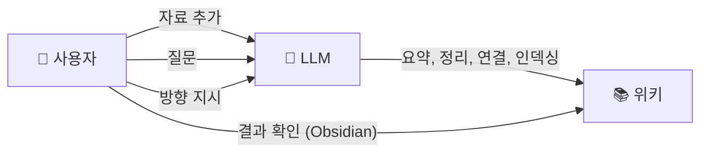
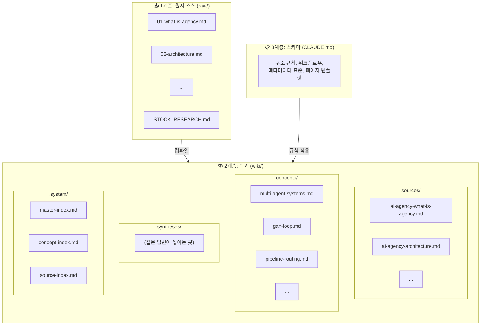
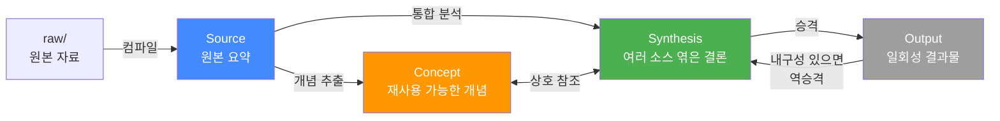
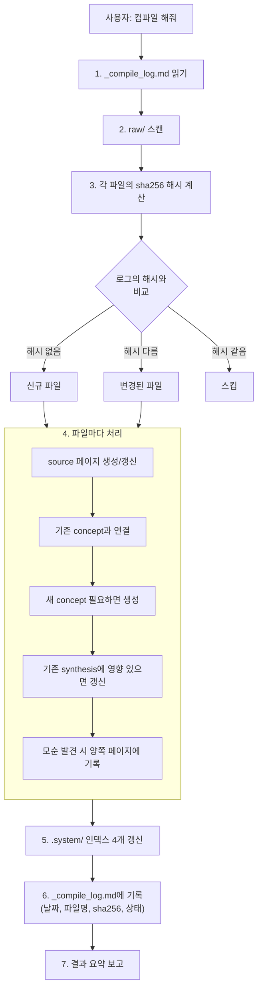
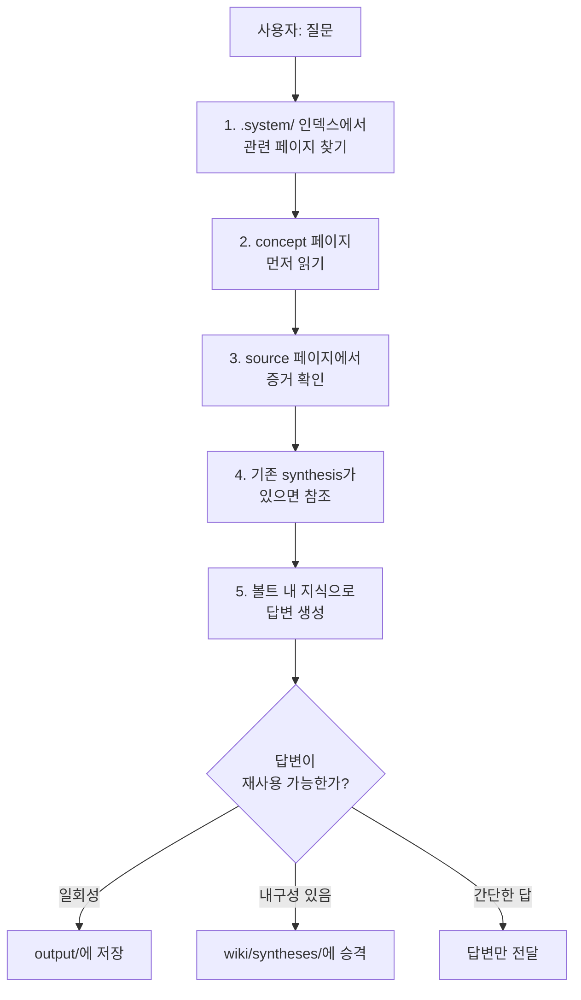
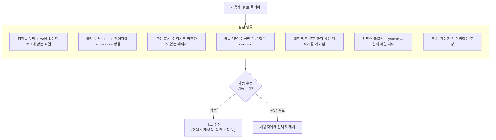
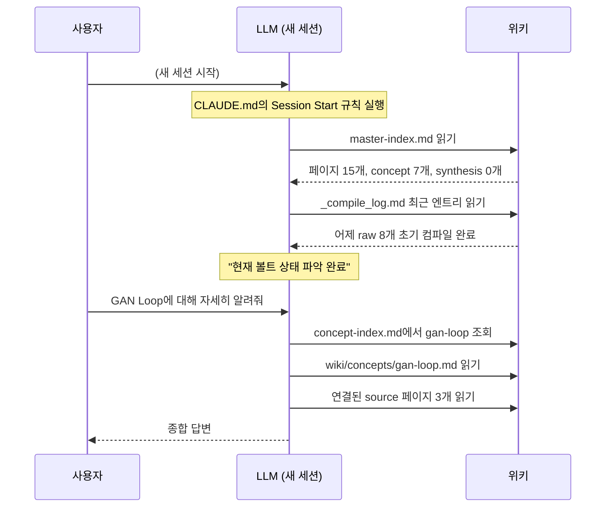
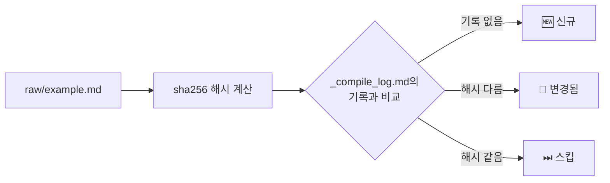
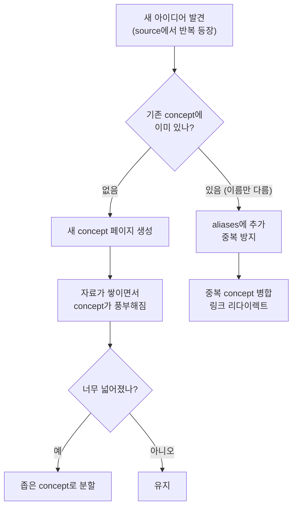
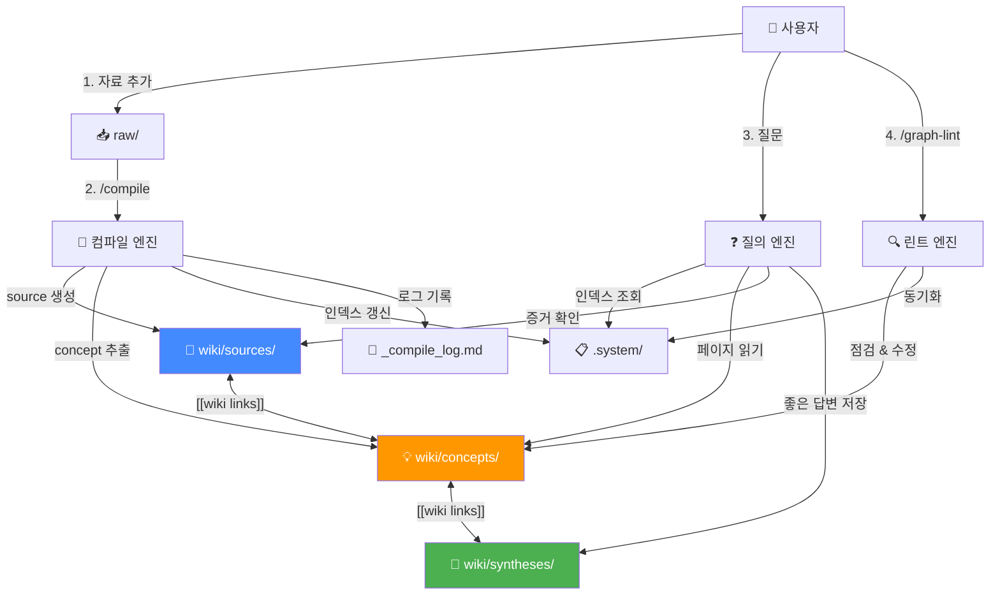

# Vault 시스템 동작 가이드

> 이 문서는 `CLAUDE.md`에 정의된 지식 관리 시스템이 어떻게 동작하는지 설명합니다.
> Obsidian에서 Mermaid 플러그인을 켜면 차트가 렌더링됩니다.

---

## 1. 한 문장 요약

**사용자가 자료를 넣고 질문하면, LLM이 자동으로 지식 그래프를 만들고 유지한다.**

일반적인 RAG(검색 증강 생성)는 질문할 때마다 원본을 처음부터 뒤진다. 이 시스템은 다르다. 자료가 들어오면 LLM이 한 번 **컴파일**해서 정리해두고, 이후엔 정리된 위키에서 바로 답을 찾는다. 자료가 쌓일수록 위키가 점점 풍부해진다.

---

## 2. 역할 분담



| | 하는 일 |
|---|---|
| **사용자** | 자료를 넣고, 질문하고, 분석 방향을 잡는다 |
| **LLM** | 요약, 상호 참조, 분류, 인덱싱, 일관성 유지 — 모든 기록 관리를 담당한다 |
| **Obsidian** | 위키를 보고 탐색하는 뷰어 (IDE 역할) |

---

## 3. 전체 아키텍처: 3계층



| 계층 | 위치 | 누가 관리하나 | 역할 |
|------|------|-------------|------|
| **원시 소스** | `raw/` | 사용자가 넣음 | 불변 원본. LLM은 읽기만 한다 |
| **위키** | `wiki/` | LLM이 생성/관리 | 정리된 지식 그래프. 사용자는 읽는다 |
| **스키마** | `CLAUDE.md` | 사용자+LLM이 함께 발전 | 위키의 구조와 규칙을 정의 |

---

## 4. 지식 객체 4가지



| 객체 | 위치 | 비유 | 예시 |
|------|------|------|------|
| **Source** | `wiki/sources/` | 원본 자료의 요약 카드 | "AI Agency 아키텍처 요약" |
| **Concept** | `wiki/concepts/` | 사전의 항목 | "GAN Loop", "멀티에이전트 시스템" |
| **Synthesis** | `wiki/syntheses/` | 연구 보고서의 결론 | "Agency vs Stock Research 통신 방식 비교" |
| **Output** | `output/` | 일회성 산출물 | 보고서, 슬라이드, Q&A 노트 |

**핵심:** Source는 1:1 요약이고, Concept는 여러 Source에서 반복되는 아이디어, Synthesis는 여러 개를 엮은 통합 결론이다.

---

## 5. 핵심 워크플로우

### 5-1. 컴파일 (자료 → 위키)

사용자가 `raw/`에 자료를 넣고 "컴파일 해줘"라고 하면:



**중요한 원칙:**
- 하나의 소스가 10~15개 기존 페이지에 영향을 줄 수 있다
- 새 페이지를 만드는 것보다 **기존 페이지를 풍부하게 하는 것**이 더 중요
- 새 데이터가 기존 주장과 모순되면 양쪽 페이지에 명시

### 5-2. 질문 답변 (위키 → 답변)

사용자가 질문하면:



**핵심:** 좋은 답변은 사라지지 않고 위키에 축적된다. 질문을 할수록 위키가 풍부해진다.

### 5-3. 점검/린트 (위키 건강 관리)



---

## 6. 세션 간 컨텍스트 복구

LLM은 세션이 끝나면 대화를 잊는다. 하지만 **위키가 있으면 다음 세션에서 이전 맥락을 즉시 복구**할 수 있다.



---

## 7. 파일 구조 한눈에

```
Vault/
├── raw/                          ← 사용자가 넣는 원본 자료
│   ├── 01-what-is-agency.md
│   ├── 02-architecture.md
│   ├── ...
│   └── STOCK_RESEARCH_ARCHITECTURE.md
│
├── wiki/                         ← LLM이 만들고 관리하는 지식 그래프
│   ├── sources/                  ← 원본 1:1 요약 (파란색)
│   │   ├── ai-agency-what-is-agency.md
│   │   └── ...
│   ├── concepts/                 ← 재사용 개념 (주황색)
│   │   ├── multi-agent-systems.md
│   │   ├── gan-loop.md
│   │   └── ...
│   ├── syntheses/                ← 통합 분석 (초록색)
│   │   └── (질문을 하면 여기에 쌓임)
│   └── .system/                  ← 인덱스 (숨김)
│       ├── master-index.md
│       ├── source-index.md
│       ├── concept-index.md
│       └── synthesis-index.md
│
├── output/                       ← 일회성 결과물
├── docs/                         ← 프로젝트 문서
├── _compile_log.md               ← 컴파일 이력 (날짜, 해시, 상태)
├── CLAUDE.md                     ← 시스템 규칙 (스키마)
└── .obsidian/                    ← Obsidian 설정
    ├── graph.json                ← 그래프 뷰 (색상/화살표 설정됨)
    └── ...
```

---

## 8. Obsidian 그래프 뷰

### 8-1. 색상 구분

그래프 뷰에서 지식 객체를 색상으로 구분한다:

| 색상 | 타입 | 의미 |
|------|------|------|
| 🔵 파랑 | Source | 원본 자료 요약 (`wiki/sources/`) |
| 🟠 주황/빨강 | Concept | 재사용 가능한 개념 (`wiki/concepts/`) |
| 🟢 초록 | Synthesis | 통합 분석/결론 (`wiki/syntheses/`) |
| ⚫ 회색 | 기타 | raw 파일 등 위키 외 문서 (이상적으로는 안 보여야 함) |

### 8-2. Obsidian에서 직접 설정하는 방법

`graph.json`을 파일로 직접 수정하면 Obsidian이 UI 상태로 덮어쓸 수 있다. **반드시 Obsidian 그래프 뷰 UI에서 설정**해야 한다.

**색상 그룹 설정:**

1. 그래프 뷰를 연다 (좌측 리본에서 그래프 아이콘 클릭)
2. 그래프 뷰 좌측 상단의 **설정 아이콘** (슬라이더 모양) 클릭
3. **Groups** 섹션을 펼친다
4. `New group` 버튼을 3번 클릭해서 그룹 추가:

| Query 입력값 | 색상 선택 |
|-------------|----------|
| `path:wiki/sources` | 파란색 |
| `path:wiki/concepts` | 주황색 또는 빨간색 |
| `path:wiki/syntheses` | 초록색 |

**기타 권장 설정:**

| 섹션 | 항목 | 값 | 이유 |
|------|------|------|------|
| Display | **Arrows** | 켜기 | source → concept → synthesis 방향성 표시 |
| Filters | **Orphans** | 끄기 | 연결 없는 노드 숨김으로 노이즈 감소 |

### 8-3. raw 파일이 그래프에 나타나는 문제

wiki 페이지에서 원본 파일 경로(`raw/파일명.md`)를 참조하면, Obsidian이 이것을 파일 링크로 인식하여 그래프에 회색 노드로 표시한다. raw 폴더에는 자료를 자유롭게 넣기 때문에 파일 단위로 제어하는 건 불가능하다.

**해결 방법:** 그래프 뷰 필터에서 raw 폴더 전체를 제외한다.

1. 그래프 뷰 설정 아이콘 클릭
2. **Filters** 섹션의 **Search** 입력란에 `-path:raw` 입력

이러면 raw/ 안의 모든 파일이 그래프에서 사라진다. raw에 어떤 파일을 넣든, wiki 페이지에서 어떻게 참조하든 상관없다.

---

## 9. 변경 감지: 어떻게 "바뀐 파일"을 아는가



LLM의 주관적 판단이 아니라 **sha256 해시**라는 확실한 기준을 사용한다. 파일 내용이 1바이트라도 바뀌면 해시가 달라지므로, 변경 여부를 100% 정확하게 판단할 수 있다.

---

## 10. 개념(Concept)의 생명주기

위키가 커지면 개념도 진화한다:



---

## 11. 자동화 스킬 3개

반복 작업을 명령어 하나로 실행할 수 있다:

| 스킬 | 명령어 | 하는 일 |
|------|--------|---------|
| **compile** | `/compile` | raw/ → wiki/ 전체 파이프라인 |
| **graph-lint** | `/graph-lint` | 위키 품질 점검 + 자동 수정 |
| **bootstrap** | `/bootstrap` | 초기 셋업 1회성 실행 |

---

## 12. 전체 흐름 요약



**요약:**
1. 자료를 넣는다 (`raw/`)
2. 컴파일한다 (`/compile`) → source, concept, 인덱스가 만들어진다
3. 질문한다 → 위키에서 답을 찾고, 좋은 답변은 synthesis로 저장된다
4. 주기적으로 린트한다 (`/graph-lint`) → 깨진 링크, 중복, 고아 문서를 정리한다
5. **자료가 쌓일수록 위키가 풍부해지고, 답변 품질이 올라간다**
