# Stock Research 멀티 에이전트 아키텍처 해설

> 이 문서는 `stock-research` 스킬이 트리거되는 순간부터 최종 투자 보고서가 생성되기까지의 전체 흐름을 멀티 에이전트 학습자 관점에서 상세히 설명한다.

---

## 1. 전체 구조 한눈에 보기

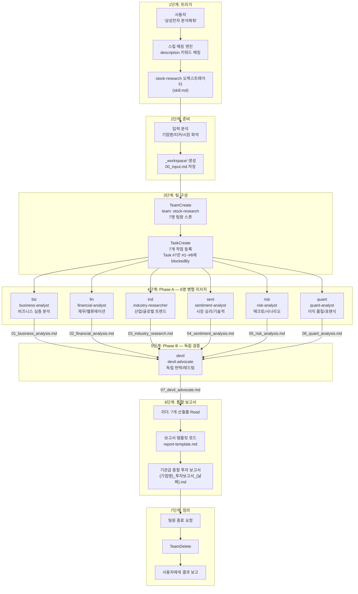

---

## 2. 스킬 트리거: 어떻게 시작되는가?

### 2.1 트리거 메커니즘

Claude Code에는 "스킬(Skill)"이라는 플러그인 시스템이 있다. 각 스킬은 `skill.md` 파일에 정의되며, YAML frontmatter의 `description` 필드가 **유일한 트리거 메커니즘**이다.

```yaml
# .claude/skills/stock-research/skill.md (frontmatter)
name: stock-research
description: >
  주식 투자를 위한 종합 기업 리서치를 수행하는 오케스트레이터.
  기업 리서치, 종목 분석, 투자 분석, 종합 투자 보고서 작성을 요청받으면
  반드시 이 스킬을 사용할 것. ...
```

사용자가 "삼성전자 분석해줘"라고 입력하면:

1. Claude Code가 등록된 모든 스킬의 `description`을 스캔한다
2. `stock-research` 스킬의 description에 "기업 리서치", "종목 분석", "투자 분석" 등의 키워드가 매칭된다
3. Claude Code가 `skill.md` 본문을 컨텍스트에 로드한다
4. 본문의 워크플로우 지시에 따라 오케스트레이터 역할을 수행한다

> **핵심 포인트:** 스킬은 "코드"가 아니라 "지시서"다. Claude가 skill.md를 읽고 그 안의 절차를 따르는 것이다.

### 2.2 스킬 vs 에이전트 vs 스크립트의 구분

| 구분 | 위치 | 역할 | 비유 |
| --- | --- | --- | --- |
| **스킬** (Skill) | `.claude/skills/*/skill.md` | "어떻게 하는가" — 절차적 가이드 | 업무 매뉴얼 |
| **에이전트** (Agent) | `.claude/agents/*.md` | "누가 하는가" — 전문가 페르소나 | 직원 역할 정의서 |
| **스크립트** (Script) | `scripts/*.py` | "어떤 도구로" — 실행 가능한 코드 | 업무용 소프트웨어 |

---

## 3. 에이전트 팀 아키텍처: 팬아웃/팬인 + 2-Phase

### 3.1 아키텍처 패턴

이 프로젝트는 **팬아웃/팬인(Fan-out/Fan-in)** 패턴을 사용한다:

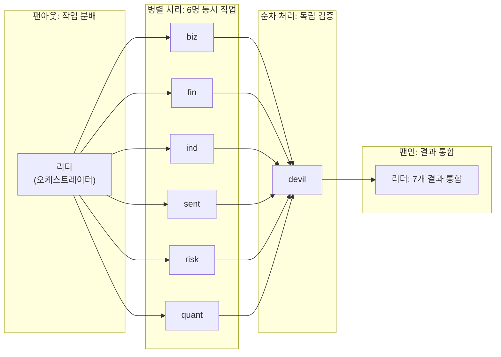

**왜 이 패턴을 선택했는가?**

- 6개 분석 영역은 **서로 독립적**으로 시작할 수 있다 (병렬화 가능)
- 하지만 분석 중간에 **발견을 공유**하면 품질이 올라간다 (팀 통신 필요)
- devil(데빌스 애드보킷)은 **모든 분석이 끝난 후에만** 의미가 있다 (순차 의존)
- 최종 통합은 **리더만** 할 수 있다 (팬인)

### 3.2 서브 에이전트 vs 에이전트 팀 — 왜 에이전트 팀을 선택했는가?

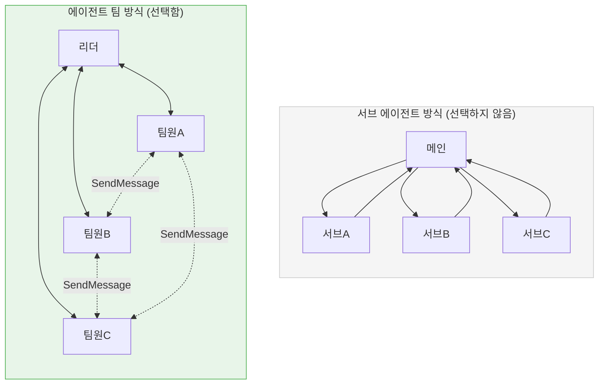

| 특성 | 서브 에이전트 | 에이전트 팀 |
| --- | --- | --- |
| 팀원 간 통신 | 불가능 (메인 거쳐야 함) | **직접 SendMessage** |
| 발견 공유 | 메인이 중계해야 함 | 팀원끼리 실시간 교환 |
| 적합한 상황 | 독립적 단발 작업 | **교차 분석이 필요한 리서치** |

**결정적 이유:** 재무 분석가(fin)가 "매출총이익률이 산업 평균보다 15%p 낮다"는 것을 발견하면, 산업 분석가(ind)에게 직접 "산업 전체가 하락 추세인지 확인해달라"고 요청할 수 있어야 한다. 서브 에이전트 방식에서는 이것이 불가능하다.

---

## 4. 7명의 에이전트 상세 해설

### 4.1 에이전트 구성 전체 맵

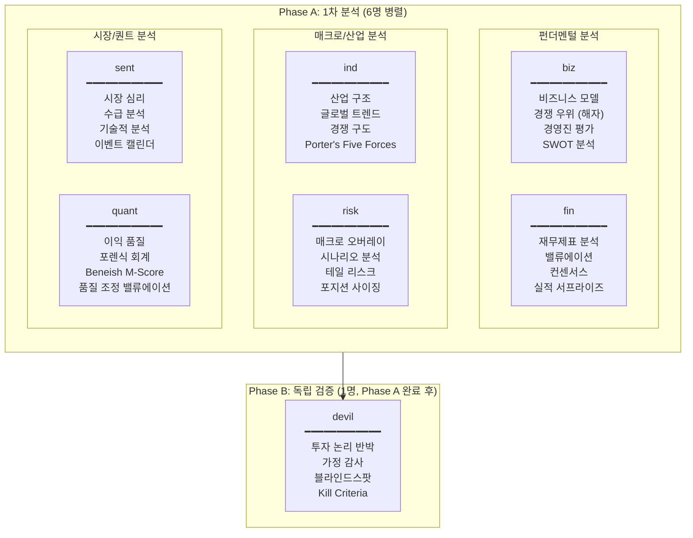

### 4.2 각 에이전트의 역할, 스킬, 산출물

#### (1) biz — Business Analyst (비즈니스 심층 분석)

| 항목 | 내용 |
| --- | --- |
| **에이전트 파일** | `.claude/agents/business-analyst.md` |
| **스킬 파일** | `.claude/skills/business-analysis/skill.md` |
| **핵심 질문** | "이 기업은 무엇을 해서 어떻게 돈을 버는가? 그 구조가 지속 가능한가?" |
| **분석 영역** | 비즈니스 모델, 경쟁 우위(해자), 경영진 역량, SWOT, Bull/Bear Case |
| **산출물** | `_workspace/01_business_analysis.md` |
| **주요 도구** | Tavily(기업 뉴스), Perplexity(심층 분석) |

**스킬이 제공하는 프레임워크:**

- 워런 버핏의 해자(Moat) 분석: 브랜드, 네트워크 효과, 전환 비용, 비용 우위, 무형 자산
- 균형 분석 체크리스트: 모든 강점에 약화 시나리오 포함, Bear Case 동일 분량

#### (2) fin — Financial Analyst (재무/밸류에이션)

| 항목 | 내용 |
| --- | --- |
| **에이전트 파일** | `.claude/agents/financial-analyst.md` |
| **스킬 파일** | `.claude/skills/financial-analysis/skill.md` |
| **핵심 질문** | "이 기업의 재무 상태는 건전한가? 현재 주가는 적정한가?" |
| **분석 영역** | 재무제표 3개년 추세, 밸류에이션(PER/PBR/EV/EBITDA), 컨센서스 |
| **산출물** | `_workspace/02_financial_analysis.md` |
| **주요 도구** | Tavily(실적 데이터), Perplexity(재무 분석) |

**스킬이 제공하는 프레임워크:**

- 3중 밸류에이션 비교: 역사적 비교, 동종 비교, 성장률 대비
- 밸류에이션 함정 경고: 저PER이 항상 저평가는 아님, 적자 기업 PSR 사용

#### (3) ind — Industry Researcher (산업/트렌드)

| 항목 | 내용 |
| --- | --- |
| **에이전트 파일** | `.claude/agents/industry-researcher.md` |
| **스킬 파일** | `.claude/skills/industry-research/skill.md` |
| **핵심 질문** | "이 산업은 어디로 가고 있고, 이 기업은 그 흐름에서 어떤 위치인가?" |
| **분석 영역** | 산업 구조(TAM/SAM), Porter's Five Forces, 글로벌 트렌드, 기업 포지셔닝 |
| **산출물** | `_workspace/03_industry_research.md` |
| **주요 도구** | Tavily(산업 뉴스), Perplexity(트렌드 분석) |

**스킬이 제공하는 프레임워크:**

- 순풍(Tailwind) vs 역풍(Headwind) 균형 분석
- 트렌드-기업 연결 필수: 트렌드를 나열만 하면 안 되고, 기업에 미치는 영향을 구체적으로 분석

#### (4) sent — Sentiment Analyst (시장 심리/기술적 분석)

| 항목 | 내용 |
| --- | --- |
| **에이전트 파일** | `.claude/agents/sentiment-analyst.md` |
| **스킬 파일** | `.claude/skills/sentiment-analysis/skill.md` |
| **핵심 질문** | "시장은 지금 이 주식을 어떻게 보고 있는가? 기술적으로 어떤 위치인가?" |
| **분석 영역** | 뉴스 센티먼트, 기관/외국인/개인 수급, RSI/MACD/지지저항, 이벤트 캘린더 |
| **산출물** | `_workspace/04_sentiment_analysis.md` |
| **주요 도구** | Tavily(시장 뉴스/수급), Perplexity(기술적 분석) |

**스킬이 제공하는 프레임워크:**

- 센티먼트의 역설: 극단적 낙관은 위험 신호, 극단적 비관은 기회 신호
- 기술적 분석 한계 명시 필수: "반드시 오른다/내린다" 같은 단정 금지

#### (5) risk — Risk Analyst (매크로/시나리오/리스크)

| 항목 | 내용 |
| --- | --- |
| **에이전트 파일** | `.claude/agents/risk-analyst.md` |
| **스킬 파일** | `.claude/skills/risk-analysis/skill.md` |
| **핵심 질문** | "어떤 외부 변수가 이 기업에 영향을 주고, 최악의 시나리오는 무엇인가?" |
| **분석 영역** | 매크로 변수(금리/환율/유가), 확률 가중 시나리오, 테일 리스크, 리스크/리워드 비대칭 |
| **산출물** | `_workspace/05_risk_analysis.md` |
| **주요 도구** | FRED API(거시경제 데이터), Tavily, Perplexity |

**고유한 특징:**

- 리스크를 정량화: "높은 리스크"가 아니라 "10% 확률로 30% 하락"
- 확률 가중 시나리오 합계 100%: Bull/Base/Bear + Tail Risk

#### (6) quant — Quant Analyst (이익 품질/포렌식 회계)

| 항목 | 내용 |
| --- | --- |
| **에이전트 파일** | `.claude/agents/quant-analyst.md` |
| **스킬 파일** | `.claude/skills/quant-analysis/skill.md` |
| **핵심 질문** | "보고된 이익은 진짜인가? 회계적으로 수상한 부분은 없는가?" |
| **분석 영역** | Beneish M-Score, Altman Z-Score, Piotroski F-Score, 발생주의 비율, 품질 조정 밸류에이션 |
| **산출물** | `_workspace/06_quant_analysis.md` |
| **주요 도구** | DART API(한국 기업 공시), Tavily, Perplexity |

**고유한 특징:**

- fin(재무 분석)이 "숫자가 무엇인가"를 분석한다면, quant는 "그 숫자를 믿을 수 있는가"를 검증
- 품질 조정 밸류에이션: 이익의 지속 가능성에 할인율 적용

#### (7) devil — Devil's Advocate (독립 반박)

| 항목 | 내용 |
| --- | --- |
| **에이전트 파일** | `.claude/agents/devil-advocate.md` |
| **스킬 파일** | `.claude/skills/devil-advocate-analysis/skill.md` |
| **핵심 질문** | "이 투자 논리의 가장 큰 약점은 무엇인가? 우리가 놓친 것은?" |
| **분석 영역** | 투자 논리 스트레스 테스트, 공유 가정 감사, 블라인드스팟, 역사적 유사 사례, Kill Criteria |
| **산출물** | `_workspace/07_devil_advocate.md` |
| **실행 시점** | Phase A(6명) 모두 완료 후 (TaskCreate의 `blockedBy` 의존성) |

**왜 별도 Phase인가?**

- 다른 6명의 결론을 **모두 읽은 후에** 반박해야 의미가 있다
- 다른 분석가와 **통신하지 않는다** — 독립성이 핵심

---

## 5. 팀원 간 통신 네트워크 (SendMessage)

에이전트 팀의 가장 큰 장점은 팀원 간 직접 통신이다. Phase A에서 6명의 에이전트가 어떻게 정보를 교환하는지 보자.

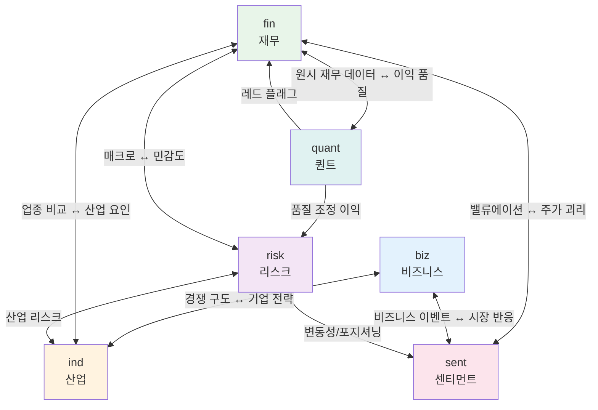

### 통신 규칙

| 발신자 | 수신자 | 공유 내용 | 예시 |
| --- | --- | --- | --- |
| biz | ind | 기업 경쟁 포지션 | "삼성전자가 파운드리 시장 점유율 17%로 2위" |
| biz | risk | 사업 집중도 리스크 | "매출 70%가 반도체 단일 사업" |
| fin | ind | 업종 평균 대비 이상치 | "영업이익률이 산업 평균보다 15%p 낮은데 산업 요인인지 확인 필요" |
| fin | sent | 실적 서프라이즈 패턴 | "최근 3분기 연속 컨센서스 상회" |
| fin | quant | 원시 재무 데이터 | "CFO, 발생주의 비율, 운전자본 변동" |
| fin | risk | 이익 민감도 | "환율 10원 변동 시 영업이익 500억 영향" |
| ind | biz | 경쟁 구도 변화 | "중국 CXMT의 DRAM 시장 진입 가속화" |
| ind | fin | 산업 평균 데이터 | "반도체 산업 평균 영업이익률 25%" |
| ind | risk | 산업 특유 리스크 | "미중 무역 분쟁 재점화 시 반도체 수출 규제 가능성" |
| sent | fin | 주가-밸류에이션 괴리 | "PER 역사적 하단인데 기관 순매수 전환" |
| sent | risk | 변동성 극단값 | "VIX 30 돌파, 역사적 상위 5% 변동성" |
| quant | fin | 이익 품질 레드 플래그 | "발생주의 비율 악화, 현금 전환율 하락" |
| quant | risk | 품질 조정 이익 | "보고 이익 대비 지속 가능 이익 20% 할인 필요" |
| risk | ALL | 매크로 레짐 변화 경고 | "금리 인상 사이클 재개 신호. 전체 분석 재점검 필요" |

---

## 6. 데이터 흐름: 파일 기반 + 메시지 기반

### 6.1 두 가지 데이터 전달 방식

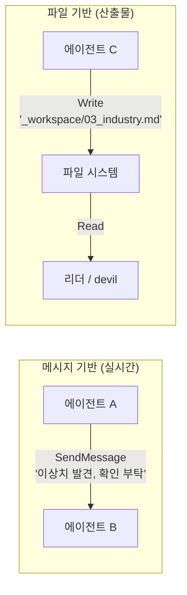

| 방식 | 용도 | 도구 | 타이밍 |
| --- | --- | --- | --- |
| **메시지 기반** | 실시간 발견 공유, 질의/응답 | `SendMessage` | 분석 중 수시 |
| **파일 기반** | 최종 산출물 전달 | `Write` → `Read` | 작업 완료 시 |

**왜 두 가지를 병행하는가?**

- 메시지: "금리 인상 가능성 높아졌어, 네 분석에 반영해" → 즉각 반영 가능
- 파일: 최종 분석 결과는 구조화된 문서로 저장해야 통합 시 활용 가능

### 6.2 산출물 파일 맵

```
_workspace/
├── 00_input.md                    # 리더가 작성 (입력 정보)
├── 01_business_analysis.md        # biz 작성
├── 02_financial_analysis.md       # fin 작성
├── 03_industry_research.md        # ind 작성
├── 04_sentiment_analysis.md       # sent 작성
├── 05_risk_analysis.md            # risk 작성
├── 06_quant_analysis.md           # quant 작성
└── 07_devil_advocate.md           # devil 작성 (Phase B)

{기업명}_투자보고서_{날짜}.md         # 리더가 7개를 통합하여 최종 생성
```

---

## 7. 리서치 도구 체계

### 7.1 4개 API + 2개 빌트인

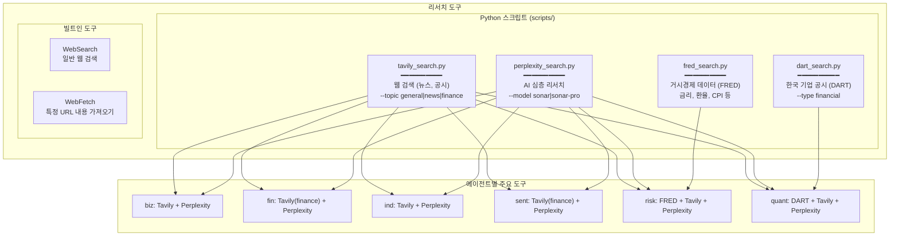

### 7.2 API 키 관리

모든 API 키는 프로젝트 루트의 `.env` 파일에 저장된다. 스크립트들은 실행 시 자동으로 `.env`를 로드한다.

```
# .env (실제 키는 절대 커밋하지 않는다)
TAVILY_API_KEY=tvly-...
PERPLEXITY_API_KEY=pplx-...
DART_API_KEY=...
FRED_API_KEY=...
```

---

## 8. Phase 흐름 상세

### 8.1 전체 타임라인

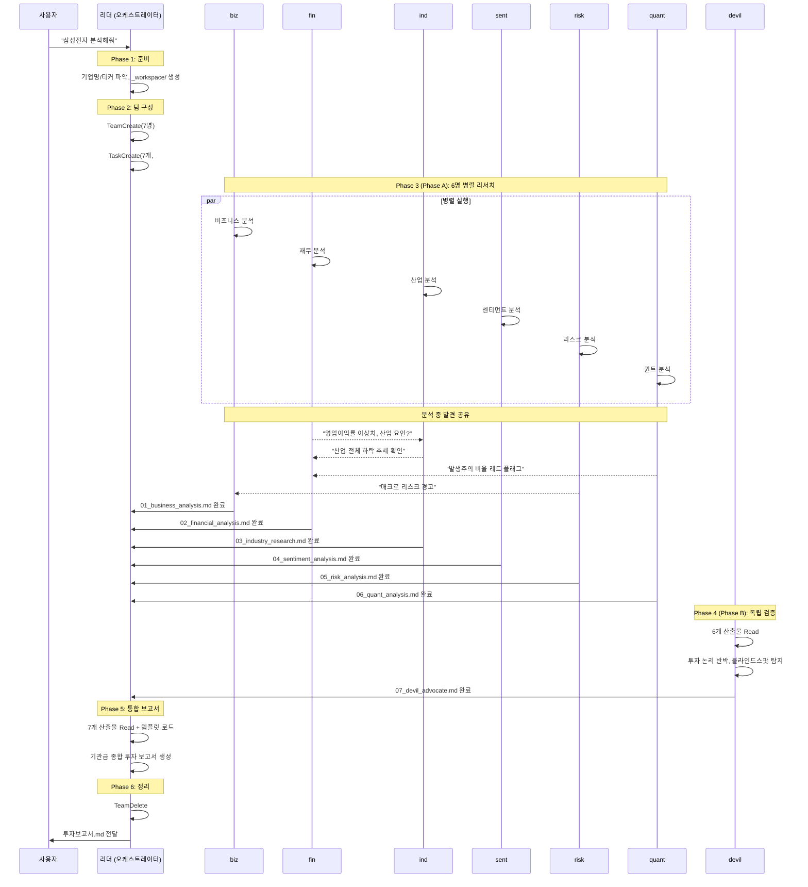

### 8.2 blockedBy 의존성

Task #7(devil)은 TaskCreate 시점에 `blockedBy: [1, 2, 3, 4, 5, 6]`으로 설정된다. 이것은 Claude Code의 에이전트 팀 프레임워크가 제공하는 기능으로:

- Task #1\~#6이 모두 `completed` 상태가 되어야 Task #7이 `unblocked` 상태가 된다
- devil 에이전트는 자신의 Task가 unblocked될 때까지 대기한다
- 리더가 수동으로 관리할 필요 없이 프레임워크가 자동 처리한다

---

## 9. 에이전트 → 스킬 연결 방식

각 에이전트가 스킬을 어떻게 활용하는지 이해하는 것이 중요하다.

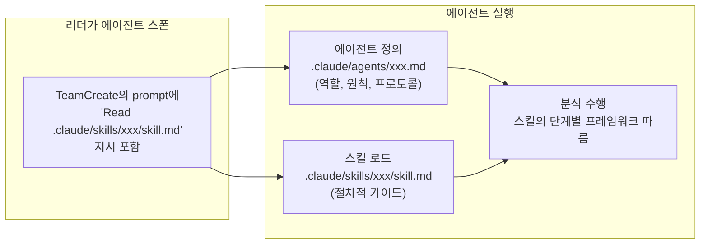

**흐름 설명:**

1. 리더가 `TeamCreate`로 팀원을 스폰할 때, `prompt` 파라미터에 "Read .claude/skills/business-analysis/skill.md" 지시를 포함한다
2. 스폰된 에이전트(예: biz)는:
   - 자신의 **에이전트 정의** (`.claude/agents/business-analyst.md`)에서 역할, 원칙, 통신 프로토콜을 인식한다
   - **스킬** (`.claude/skills/business-analysis/skill.md`)을 Read하여 구체적 분석 절차를 로드한다
3. 에이전트 정의의 "누가"와 스킬의 "어떻게"를 결합하여 분석을 수행한다

---

## 10. 최종 보고서 구조

7개 분석이 하나의 보고서로 통합되는 과정:

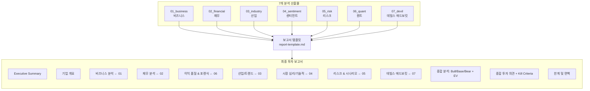

### 보고서의 고유 섹션 (v2.0에서 추가)

| 섹션 | 데이터 출처 | 설명 |
| --- | --- | --- |
| 이익 품질 대시보드 | quant | Beneish M-Score, 현금 전환율, 발생주의 비율 |
| 확률 가중 시나리오 | risk | Bull 30% / Base 50% / Bear 15% / Tail 5% (합계 100%) |
| 데빌스 애드보킷 반박 | devil | 투자 논리의 약점, 블라인드스팟, 가정 오류 |
| Kill Criteria | devil | 투자 논리가 무효화되는 구체적 조건 (지표 + 임계값 + 확인 주기) |
| Expected Value | risk + devil | EV = Sum(확률\_i x 수익률\_i), 리스크/리워드 비대칭성 |
| 컨빅션 스코어 | devil | Strong / Moderate / Weak (반박을 견뎌냈는지 평가) |

---

## 11. 에러 핸들링 시나리오

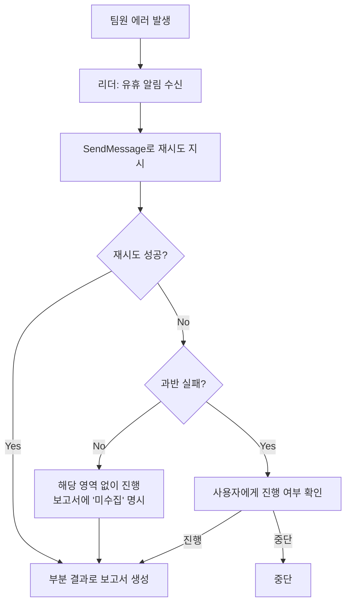

---

## 12. 파일 구조 전체 맵

```
stock-research/
├── .env.example                         # API 키 템플릿
├── .env                                 # API 키 (gitignore 대상)
├── STOCK_RESEARCH_ARCHITECTURE.md       # 이 문서
│
├── scripts/                             # 리서치 도구 스크립트
│   ├── tavily_search.py                 # Tavily API 래퍼 (웹 검색)
│   ├── perplexity_search.py             # Perplexity API 래퍼 (AI 리서치)
│   ├── dart_search.py                   # DART API 래퍼 (한국 기업 공시)
│   └── fred_search.py                   # FRED API 래퍼 (거시경제 데이터)
│
├── .claude/
│   ├── agents/                          # 에이전트 정의 (누가)
│   │   ├── business-analyst.md          # biz: 비즈니스 심층 분석
│   │   ├── financial-analyst.md         # fin: 재무/밸류에이션
│   │   ├── industry-researcher.md       # ind: 산업/트렌드
│   │   ├── sentiment-analyst.md         # sent: 시장 심리/기술적 분석
│   │   ├── risk-analyst.md              # risk: 매크로/시나리오/리스크
│   │   ├── quant-analyst.md             # quant: 이익 품질/포렌식 회계
│   │   └── devil-advocate.md            # devil: 독립 반박/레드팀
│   │
│   └── skills/                          # 스킬 정의 (어떻게)
│       ├── stock-research/              # 오케스트레이터 (진입점)
│       │   ├── skill.md                 # 전체 워크플로우 정의
│       │   └── references/
│       │       └── report-template.md   # 보고서 템플릿
│       ├── business-analysis/
│       │   └── skill.md                 # 비즈니스 분석 프레임워크
│       ├── financial-analysis/
│       │   └── skill.md                 # 재무 분석 프레임워크
│       ├── industry-research/
│       │   └── skill.md                 # 산업 리서치 프레임워크
│       ├── sentiment-analysis/
│       │   └── skill.md                 # 센티먼트 분석 프레임워크
│       ├── risk-analysis/
│       │   └── skill.md                 # 리스크 분석 프레임워크
│       ├── quant-analysis/
│       │   └── skill.md                 # 퀀트 분석 프레임워크
│       └── devil-advocate-analysis/
│           └── skill.md                 # 데빌스 애드보킷 프레임워크
│
└── _workspace/                          # 실행 시 생성되는 작업 디렉토리
    ├── 00_input.md                      # 입력 정보
    ├── 01_business_analysis.md          # biz 산출물
    ├── 02_financial_analysis.md         # fin 산출물
    ├── 03_industry_research.md          # ind 산출물
    ├── 04_sentiment_analysis.md         # sent 산출물
    ├── 05_risk_analysis.md              # risk 산출물
    ├── 06_quant_analysis.md             # quant 산출물
    └── 07_devil_advocate.md             # devil 산출물
```

---

## 13. 핵심 개념 요약

| 개념 | 설명 | 이 프로젝트에서의 적용 |
| --- | --- | --- |
| **스킬 트리거** | description 키워드 매칭으로 자동 활성화 | "분석해줘" → stock-research 스킬 트리거 |
| **오케스트레이터** | 팀 전체를 조율하는 상위 스킬 | stock-research/skill.md |
| **에이전트 팀** | TeamCreate로 구성, SendMessage로 통신 | 7명 팀원이 자체 조율 |
| **팬아웃/팬인** | 병렬 분배 → 결과 통합 패턴 | 6명 병렬 → devil 검증 → 통합 |
| **blockedBy** | 작업 의존성 관리 | Task #7(devil)이 #1\~#6에 의존 |
| **파일 기반 전달** | \_workspace/에 산출물 저장 | 7개 마크다운 파일 |
| **메시지 기반 전달** | SendMessage로 실시간 발견 공유 | 분석 중 교차 질의/정보 교환 |
| **균형 분석 원칙** | 긍정/부정 동일 비중 | 모든 에이전트에 체크리스트 내장 |
| **2-Phase 실행** | 1차 병렬 분석 → 2차 독립 검증 | Phase A(6명) → Phase B(devil) |
